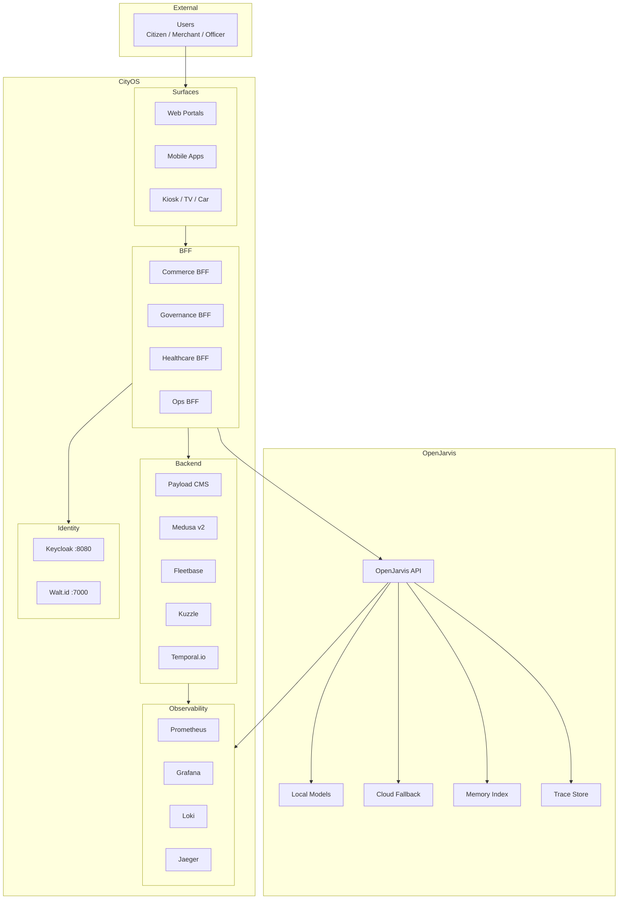

# System Context and Architecture

> [← Back to CityOS Integrations](../index.md)

This document defines how OpenJarvis fits into the Dakkah CityOS architecture, including threat model, data flow diagrams, and trust boundaries.

**Related**: [Integration Overview](../integration/overview.md) · [Deployment Overview](../deployment/overview.md) · [Compliance Overview](../compliance/overview.md)



## Trust boundaries

### Boundary 1: User → Surface
- Authentication via Keycloak OIDC.
- Transport: HTTPS with TLS 1.3.
- Threats: Credential theft, session hijacking, XSS.
- Controls: `httpOnly` cookies, CSP headers, strict SameSite, input validation.

### Boundary 2: Surface → BFF Gateway
- Authorization via JWT + RBAC.
- Threats: IDOR, privilege escalation, replay attacks.
- Controls: `withBff()` wrapper, `rbacChecker.ts`, rate limiting, request signing.

### Boundary 3: BFF → OpenJarvis
- Data classification gate (public / internal / restricted / regulated).
- Threats: Data exfiltration, prompt injection, model poisoning.
- Controls: Redaction pipeline, input sanitization, output filtering, tenant isolation.

### Boundary 4: OpenJarvis → External Models
- Local models run inside CityOS network boundary.
- Cloud fallback crosses the trust boundary — requires explicit approval.
- Threats: Data leakage to third parties, API key compromise.
- Controls: API key rotation, request logging, data minimization, fallback policies.

## Data flow: Citizen support request

```
1. Citizen → smart-city-portal (Next.js 15)
2. Portal → BFF Gateway (citizen BFF, port 4002)
3. BFF → Keycloak (validate JWT, extract tenant)
4. BFF → Data Classification (redact PII if needed)
5. BFF → OpenJarvis (/v1/chat/completions)
6. OpenJarvis → Local Model (default) or Cloud Fallback
7. OpenJarvis → MCP Tool Call (cityos-governance-mcp)
8. MCP → Domain Service (governance permit lookup)
9. Domain Service → PostgreSQL (tenant-scoped query)
10. Response → BFF (validate, redact)
11. BFF → Portal (SDUI blocks)
12. Portal → Citizen (rendered UI)
13. Async: BFF writes audit log, OpenJarvis writes trace
```

## Network segmentation

CityOS Docker Compose projects define network boundaries:

| Network | Contains | OpenJarvis Access |
|---|---|---|
| `cityos-infra` | PostgreSQL, Redis, Meilisearch, MinIO, monitoring | Indirect (via BFF) |
| `cityos-apps-backend` | Payload, Medusa, Fleetbase, OpenJarvis | Direct (container) |
| `cityos-apps-surfaces` | Next.js portals, Storybook | No direct access |
| `cityos-bff` | BFF gateways, MCP servers | Direct (MCP client) |
| `cityos-helpers` | Ops-helper, deploy agent | Indirect (via APIs) |

## Threat model: Top risks

| Threat | Likelihood | Impact | Mitigation |
|---|---|---|---|
| Prompt injection via citizen input | High | Medium | Input sanitization, output filtering, human escalation |
| Tenant isolation breach | Medium | Critical | RBAC + Node hierarchy validation in every query |
| PHI leakage to OpenJarvis | Medium | Critical | PHI detector gate, block by default, compliance review |
| Cloud model data exfiltration | Low | High | Local-first default, audit cloud requests, API key rotation |
| MCP tool abuse | Medium | High | Tool allowlist, RBAC per tool, rate limiting, audit logs |
| Model hallucination in gov decisions | Medium | High | Human confirmation for privileged actions, source citations |

## Deployment placement

OpenJarvis should run in `cityos-apps-backend` for:
- Direct access to BFF networks
- Shared local model storage (GPU volumes)
- Proximity to Payload CMS for memory indexing

Alternatively, run in `cityos-helpers` for:
- Operational separation from business apps
- Shared ops-helper volumes for trace storage
- Easier ops team access

## Compliance boundaries

- **Governance data** (permits, cases) — processed inside CityOS boundary only.
- **Commerce data** (orders, payments) — PCI-scoped data never reaches OpenJarvis.
- **Healthcare data** — PHI blocked by default; requires explicit legal approval.
- **IoT telemetry** — anonymized before AI analysis unless owner-consented.

---

## See also

- [Integration Overview](../integration/overview.md) — High-level integration patterns
- [Deployment Overview](../deployment/overview.md) — Deployment patterns and compose projects
- [Compliance Overview](../compliance/overview.md) — Compliance topics and identity stack
- [Operations Overview](../operations/overview.md) — Day-2 operational guidance
- [Testing Strategy](../operations/testing-strategy.md) — Testing OpenJarvis integrations
