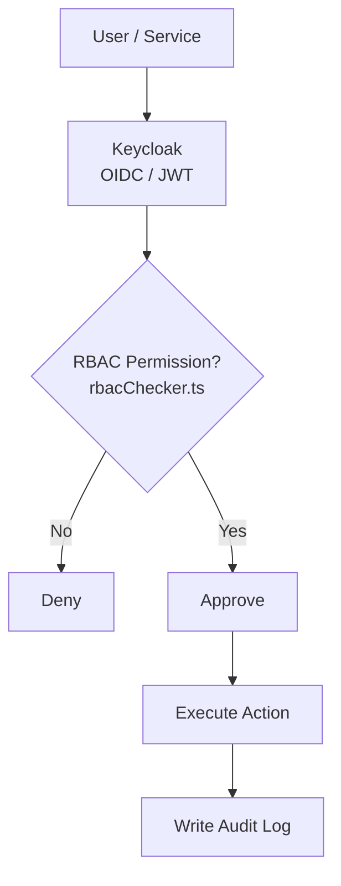

# Authorization and Audit

> [← Back to Compliance Overview](overview.md) · [← CityOS Integrations](../index.md)

CityOS integrations should fail closed when permissions are missing. Authorization flows through Keycloak OIDC/JWT, custom RBAC, and BFF gateway enforcement.

**Related**: [Compliance Overview](overview.md) · [Data Handling](data-handling.md)



## Permission model

Separate actions into tiers, aligned with CityOS RBAC roles:

| Tier | Examples | Approval |
|---|---|---|
| Read-only lookup | Policy search, directory lookup, case status | Automatic |
| Low-risk write | Submit feedback, create low-priority ticket | Automatic (with auth) |
| Approval-required write | Permit application, service request | Human confirmation |
| Privileged or irreversible action | Refund, account closure, rollback restore | Elevated role + human confirmation |

## Authorization requirements

For each action, document:

- The actor identity (Keycloak user/subject)
- The service identity (BFF gateway client ID)
- The permission scope (RBAC role from `docs/RBAC_AND_ROLES_SPECIFICATION.md`)
- The approval gate (automatic, human, or elevated role)
- The allow or deny rule
- The fallback behavior (static error block, escalation, queued retry)

## Keycloak and JWT flow

1. User authenticates via Keycloak (port 8080).
2. Keycloak issues an OIDC ID token and access token.
3. CityOS surfaces store the session in an `ops-session` cookie (JWT, 8h expiry, httpOnly, strict sameSite).
4. BFF gateway validates the JWT on every request.
5. `rbacChecker.ts` extracts roles/claims and enforces permission checks.
6. Never trust client-side role checks — always validate server-side in BFF routes.

## BFF gateway enforcement

Every BFF API route **must** use:

- `withBff()` wrapper from `src/lib/bff/withBff.ts` — handles auth, rate limiting, error formatting.
- `rbacChecker.ts` from `src/lib/bff/rbacChecker.ts` — permission checks against RBAC roles.
- `errors.ts` from `src/lib/api/errors.ts` — typed error classes, never raw strings.

Example pattern:
```typescript
import { withBff } from "@/lib/bff/withBff";
import { checkPermission } from "@/lib/bff/rbacChecker";

export const POST = withBff(async (req, ctx) => {
  checkPermission(ctx.user, "governance:permit:write");
  // ... action
});
```

## Audit logging requirements

Audit logs should record:

- Timestamp
- Actor (Keycloak sub, username, role)
- Target system (domain, service, container)
- Action requested
- Action approved or denied
- Tool or endpoint used
- Result (success, failure, timeout)
- Correlation identifier (trace ID, job ID, request ID)
- Tenant / Node context

## Review requirements

- High-risk actions should require human confirmation via the ops-helper-ui or a dedicated approval workflow.
- Privileged actions should be traceable back to a named user or service principal in Keycloak.
- Audit records should be immutable or protected from casual modification (append-only JSON Lines, write-once storage).
- Logs should not expose secrets or full sensitive payloads unless policy allows it. Redact JWT tokens, API keys, and passwords.

## Minimum audit questions

- Who initiated the request (Keycloak identity)?
- What was the model asked to do (prompt classification)?
- Which tools were called (MCP tool names)?
- Was anything mutated (write tier)?
- Was the output reviewed by a human (approval gate)?
- Can the event be reconstructed later (trace + audit log + job log)?
- Which tenant/Node was affected?

---

## See also

- [Compliance Overview](overview.md) — Core compliance topics
- [Data Handling](data-handling.md) — Data flow and redaction rules
- [Integration Overview](../integration/overview.md) — BFF gateway and MCP patterns
- [System Context](../architecture/system-context.md) — Trust boundaries and threat model
- [Security and Compliance Assistant](../use-cases/security-compliance-assistant.md) — RBAC audit and anomaly detection use case
