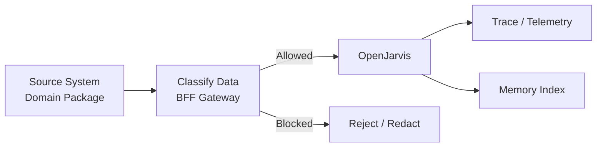

# Data Handling

> [← Back to Compliance Overview](overview.md) · [← CityOS Integrations](../index.md)

Use this document to define what CityOS may send to OpenJarvis and what OpenJarvis may retain. CityOS handles data across ~120 domains with multi-tenant isolation.

**Related**: [Compliance Overview](overview.md) · [Authorization and Audit](authorization-audit.md)

## Data categories

Document each category explicitly before any data leaves CityOS:

| Category | Examples | OpenJarvis Allowed? |
|---|---|---|
| Public information | City policies, public transit schedules, event listings | Yes |
| Internal operational data | Container statuses, deployment logs, job outputs | Yes (ops context) |
| User-provided text | Support questions, feedback, search queries | Yes (with consent) |
| System logs | API access logs, error traces | Yes (redacted) |
| Audit records | RBAC checks, BFF audit trail | No — stay in CityOS |
| Regulated or sensitive data | Healthcare records, payment info, citizen PII | No — unless explicitly approved |
| Secrets and credentials | API keys, database passwords, JWT signing keys | Never |

## Multi-tenancy and storage isolation

CityOS isolates tenant data through the Node hierarchy and storage layers:

- **PostgreSQL + PostGIS** — tenant-scoped schemas or row-level security per Node.
- **MinIO** — per-tenant buckets or bucket prefixes for object storage.
- **Meilisearch** — tenant-scoped indexes or filter attributes.
- **Payload CMS** — collection-level access control with `payload-auth` plugin hooks.

OpenJarvis must not commingle data from different tenants in its memory index or trace store unless explicitly configured for cross-tenant analysis (and approved).

## Minimum controls

- Classify incoming requests at the BFF gateway before they are sent to the model.
- Avoid sending secrets, tokens, or credentials to the model. `envValidator.ts` should never be referenced in prompts.
- Redact personal data unless the use case requires it and policy allows it. Use the analytics redaction module (`src/openjarvis/analytics/redaction.py`) as a reference.
- Store only the minimum data needed for traceability and operations.
- Keep retention rules visible and versioned in `docs/runbooks/`.

## Storage locations to document

| Store | Path / Endpoint | Owner | Retention |
|---|---|---|---|
| PostgreSQL + PostGIS | `CITYOS_POSTGRES_CONTAINER_NAME` | CityOS | Per domain policy |
| MinIO buckets | `MINIO_ENDPOINT` | CityOS | Per tenant policy |
| OpenJarvis trace DB | Local SQLite or PostgreSQL | OpenJarvis | Match CityOS policy |
| OpenJarvis memory index | Local HNSW / FAISS | OpenJarvis | Match CityOS policy |
| Ops-helper jobs | `/opt/dakkah-cityos-platform/ops-helper-ui/jobs.jsonl` | CityOS | Last 1000 jobs |
| Ops-helper alerts | `/opt/dakkah-cityos-platform/ops-helper-ui/alerts.jsonl` | CityOS | Max 200 alerts |
| Ops-helper VPS history | `/opt/dakkah-cityos-platform/ops-helper-ui/vps-history.jsonl` | CityOS | 7 days |
| BFF audit logs | CityOS audit store | CityOS | Per compliance policy |

## Required answers for each dataset

- Source system (which domain package or app)
- Purpose of processing
- Whether it is stored locally (on-premise VPS) or in cloud
- Whether it is indexed for retrieval (Meilisearch, OpenJarvis memory)
- Whether it is included in traces or telemetry
- Retention period
- Deletion process (automated or manual)
- Tenant scope (single Node or cross-Node)

## Redaction rules

- Define what counts as a secret (API keys, database URIs, JWT secrets, `.env` contents).
- Define what counts as PII (national ID, phone, email, address, health records).
- Define what must never leave the trust boundary (audit records, RBAC policies, Keycloak realm config).
- Define whether summaries can be stored when raw content cannot (e.g., aggregate analytics without individual records).

---

## See also

- [Compliance Overview](overview.md) — Core compliance topics and documentation standard
- [Authorization and Audit](authorization-audit.md) — Permission model and audit requirements
- [System Context](../architecture/system-context.md) — Trust boundaries and network segmentation
- [Healthcare Assistant](../use-cases/healthcare-assistant.md) — PHI-aware use case with data classification gate
