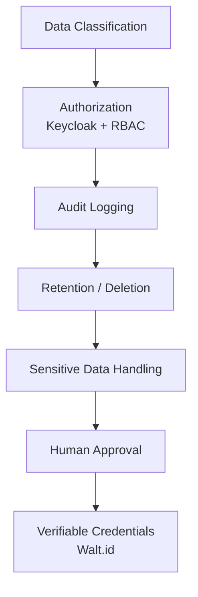

# Compliance Overview

> [← Back to CityOS Integrations](../index.md)

This section defines the compliance topics that every CityOS integration doc should address. CityOS operates across governance, healthcare, commerce, and education domains — many handling regulated or sensitive data.

**Related**: [Data Handling](data-handling.md) · [Authorization and Audit](authorization-audit.md) · [System Context](../architecture/system-context.md)

## Core compliance topics

- **Data classification** — classify all data before it reaches OpenJarvis (public, internal, restricted, regulated).
- **Authorization and least privilege** — Keycloak OIDC/JWT + custom RBAC with roles defined in `docs/RBAC_AND_ROLES_SPECIFICATION.md`.
- **Audit logging** — BFF gateway audit logs + OpenJarvis traces + ops-helper-ui job logs.
- **Retention and deletion** — CityOS persistence keeps 7 days of VPS history, 200 alerts, 10 rollback snapshots. OpenJarvis trace retention should match CityOS policy.
- **Sensitive data handling** — redact PHI, financial data, and PII before sending to OpenJarvis unless explicitly approved.
- **Human approval for high-risk actions** — mutations affecting citizens, records, or service levels require explicit confirmation.
- **Vendor and model usage boundaries** — document when cloud models are used vs. local models. Prefer local-first.
- **Tenant isolation** — validate multi-tenancy in all queries via the Node hierarchy.
- **Verifiable credentials** — Walt.id (port 7000) provides DID/VC support for citizen identity and credential verification.

## Identity and access stack

| Layer | Technology | Responsibility |
|---|---|---|
| Identity Provider | Keycloak (port 8080) | OIDC/JWT issuance, user federation |
| RBAC Engine | Custom (`rbacChecker.ts`) | Permission checks in BFF routes |
| Credentials | Walt.id (port 7000) | DID/Verifiable Credentials |
| Session | `ops-session` cookie | JWT, 8h expiry, httpOnly, strict sameSite |

## Documentation standard

Every compliance-sensitive feature must answer these questions:

- What data is processed?
- Who can access it (RBAC role + Keycloak realm)?
- Where is it stored (PostgreSQL, MinIO, local JSON Lines, OpenJarvis trace DB)?
- How long is it retained?
- Can it be redacted or deleted?
- What gets logged (BFF audit, OpenJarvis trace, ops-helper job)?
- What can be exported?
- What must be approved by a human?
- Which Node (tenant) does it belong to?

## Guidance for CityOS reviewers

- Do not assume a use case is compliant because it is technically possible.
- Describe the legal or policy boundary in plain language.
- Separate product behavior from policy interpretation.
- Mark unknowns clearly so they can be reviewed before release.
- Test tenant isolation with `pnpm audit:security` and `pnpm audit:collections`.

## Compliance disclaimer

This repository can document controls and implementation behavior, but it does not replace legal review, procurement review, or a formal compliance assessment. CityOS domains handling healthcare (PHI), governance (public records), or commerce (payment data) require additional domain-specific review.

---

## See also

- [Data Handling](data-handling.md) — Data flow, storage, retention, and redaction
- [Authorization and Audit](authorization-audit.md) — Permission model and audit logging
- [System Context](../architecture/system-context.md) — Threat model and trust boundaries
- [Security and Compliance Assistant](../use-cases/security-compliance-assistant.md) — Security operations use case
- [Healthcare Assistant](../use-cases/healthcare-assistant.md) — PHI-aware healthcare use case
