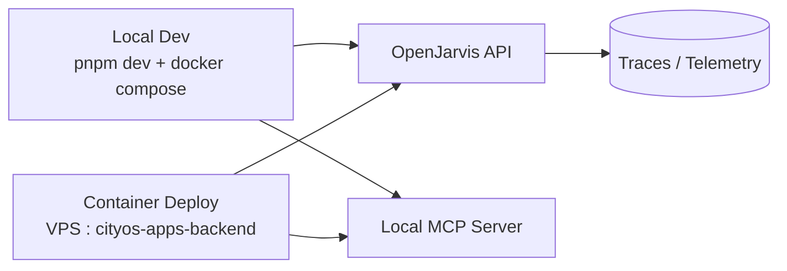

# Local and Container Deployment

> [← Back to Deployment Overview](overview.md) · [← CityOS Integrations](../index.md)

Use this document to define the first runnable CityOS integration environments. CityOS is a pnpm monorepo with Docker Compose orchestration.

**Related**: [Deployment Overview](overview.md) · [Integration Overview](../integration/overview.md) · [Testing Strategy](../operations/testing-strategy.md)



## Local development

- Run OpenJarvis on localhost alongside the CityOS dev server (`pnpm dev` on port 3000).
- Keep the OpenJarvis API key in a local secret file or environment variable (never commit `.env`).
- Use a local MCP server during development. The BFF gateway can proxy to `localhost` MCP for testing.
- Store traces and telemetry in local databases (OpenJarvis default SQLite or local PostgreSQL).
- Run the full CityOS stack locally:
  ```bash
  docker compose -f docker-compose.full.yml --profile all up -d
  pnpm dev
  ```
- Run OpenJarvis in local mode:
  ```bash
  jarvis  # or uv run jarvis
  ```

## Container deployment

- Run OpenJarvis in a dedicated container within the `cityos-apps-backend` or `cityos-helpers` compose project.
- Mount persistent volumes for config, traces, and telemetry if needed:
  ```yaml
  volumes:
    - openjarvis-data:/app/data
    - openjarvis-config:/app/config
  ```
- Put the container behind the BFF gateway when shared. The BFF gateway handles authentication and rate limiting.
- Keep the CityOS MCP server on the `cityos-bff` private network. Only the BFF gateway should reach it.
- Use the OpenJarvis Docker image from the project's `deploy/docker/Dockerfile` or build a custom one with CityOS extras:
  ```dockerfile
  FROM openjarvis:latest
  RUN uv sync --extra inference-vllm --extra memory-faiss --extra scheduler
  ```

## Environment variables to document

CityOS uses a Zod-validated environment schema in `src/lib/config/envValidator.ts`. Relevant variables for OpenJarvis integration:

| Variable | Purpose | Example |
|---|---|---|
| `OPS_HELPER_UI_AUTH_MODE` | Auth mode for ops dashboard | `basic` or `keycloak` |
| `KEYCLOAK_URL` | Keycloak OIDC issuer | `http://localhost:8080` |
| `KEYCLOAK_REALM` | Keycloak realm | `cityos` |
| `MEILISEARCH_URL` | Search endpoint | `http://localhost:7700` |
| `MINIO_ENDPOINT` | Object storage | `http://localhost:9001` |
| `KUZZLE_HOST` | Real-time event bus | `localhost:7512` |
| `TEMPORAL_HOST` | Workflow engine | `localhost:7233` |
| `OPENJARVIS_API_URL` | OpenJarvis chat endpoint | `http://localhost:8000/v1` |
| `OPENJARVIS_API_KEY` | OpenJarvis API key | (secret) |
| `VPS_APP_DIR` | VPS data directory | `/opt/dakkah-cityos-platform` |
| `VPS_SOURCE_DIR` | VPS source directory | `/opt/dakkah-cityos-cms-src` |

## Rollout steps

1. Start the CityOS infrastructure: `docker compose up -d` for `cityos-infra`.
2. Start the OpenJarvis container in `cityos-apps-backend`.
3. Verify OpenJarvis health: `curl http://localhost:8000/health`.
4. Verify CityOS auth: log in through Keycloak and obtain a JWT.
5. Verify tool discovery: call the BFF MCP catalog endpoint.
6. Test a read-only workflow (e.g., governance policy lookup).
7. Test a write workflow only after approvals, RBAC, and audit logging are in place.
8. Verify monitoring: check Prometheus targets and Grafana dashboards.

## pnpm workspace commands

```bash
pnpm install              # Install all dependencies
pnpm dev                  # Start Next.js dev server on :3000
pnpm dev:all              # Start CMS + background worker + temporal worker + studio
pnpm typecheck            # Root TypeScript check
pnpm test                 # Run unit + integration tests
pnpm payload migrate      # Run database migrations
pnpm generate:types       # Regenerate Payload TypeScript types
```

## Docker Compose profiles

- `--profile all` — starts every service including OpenJarvis (if configured).
- `--profile infra` — infrastructure only (PostgreSQL, Redis, Meilisearch, MinIO, monitoring).
- `--profile backend` — backend apps (Payload, Medusa, OpenJarvis).
- `--profile surfaces` — frontend portals.
- `--profile bff` — BFF gateways and MCP servers.
- `--profile helpers` — ops-helper, deploy agent.

---

## See also

- [Deployment Overview](overview.md) — Deployment targets and baseline controls
- [Integration Overview](../integration/overview.md) — Primary integration surfaces
- [OpenJarvis Runtime Integration](../integration/openjarvis-runtime.md) — API connection model
- [Testing Strategy](../operations/testing-strategy.md) — How to test the integration locally
- [MCP and Tool Integration](../integration/mcp-tools.md) — Tool discovery and validation
