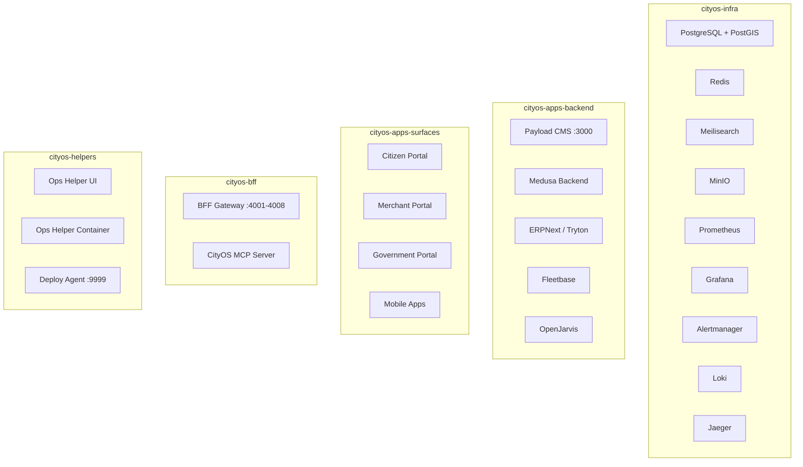

# Deployment Overview

> [← Back to CityOS Integrations](../index.md)

Document every CityOS deployment path that uses OpenJarvis. CityOS is deployed as 5 Docker Compose projects on a VPS, plus a Next.js monorepo built with pnpm.

**Related**: [Local and Container Deployment](local-and-container.md) · [System Context](../architecture/system-context.md) · [Operations Overview](../operations/overview.md)

## Deployment targets

- **Local development**: CityOS and OpenJarvis run on the same machine via `pnpm dev` and Docker Compose.
- **Container deployment**: OpenJarvis runs in a dedicated container within `cityos-apps-backend` or `cityos-helpers`.
- **Shared environment**: multiple users or services access the same OpenJarvis runtime behind the BFF gateway and Keycloak auth.
- **Private network deployment**: OpenJarvis is exposed only inside the `cityos-bff` Docker network segment.
- **VPS production**: All 5 compose projects run on a single VPS with stable container names via `COMPOSE_PROJECT_NAME=cityos`.

## Required deployment decisions

- Where the OpenJarvis API server runs (`cityos-apps-backend` vs. `cityos-helpers`).
- Where the model runtime runs (local CPU/GPU on the VPS, or separate inference host).
- How credentials are stored (`.env.vps` + `envValidator.ts` Zod schema, never in source control).
- What data is persisted locally (OpenJarvis traces, telemetry, memory index, and CityOS JSON Lines persistence in `/opt/dakkah-cityos-platform/`).
- Whether telemetry and traces are enabled (default yes for ops, no for PII-heavy domains).
- Whether the deployment is single-tenant or multi-tenant (CityOS supports both; OpenJarvis should respect tenant context).

## CityOS Docker Compose projects

| Project | Purpose | Key Services |
|---|---|---|
| `cityos-infra` | Shared infrastructure | PostgreSQL 16+, Redis, Meilisearch, MinIO, Prometheus, Grafana, Alertmanager, Loki, Jaeger |
| `cityos-apps-backend` | Backend applications | Payload CMS, Medusa v2, ERPNext, Fleetbase, OpenJarvis |
| `cityos-apps-surfaces` | Frontend surfaces | Next.js portals, Storybook |
| `cityos-bff` | Backend-for-Frontend | BFF gateways (ports 4001-4008), MCP servers |
| `cityos-helpers` | Operational tooling | Ops-helper UI, ops-helper container, deploy agent |

## Baseline controls

- Use secret storage (`.env.vps`, Keycloak vault) for API keys and service credentials.
- Restrict network exposure by default. Only `cityos-infra` services needed externally should expose ports.
- Persist logs only as long as necessary. CityOS ops-helper-ui keeps 7 days of VPS history and 200 alerts.
- Document which data stores contain prompts, traces, telemetry, or indexed content (PostgreSQL, local JSON Lines, OpenJarvis memory index).
- Set `COMPOSE_PROJECT_NAME=cityos` in `.env` and `.env.vps` to ensure stable container names across deploys.

## Validation checklist

- `/health` returns healthy.
- Authentication works as expected (Keycloak JWT flow).
- Streaming and non-streaming requests both function.
- Tool calls succeed against the CityOS MCP server (BFF gateway).
- Failure behavior is documented and tested (static SDUI error blocks, queued retry).
- All 5 compose projects start without port conflicts.
- Monitoring dashboards show all services green.

## What every deployment doc must include

- Architecture diagram or text equivalent.
- Environment variables (from `.env.example` and `envValidator.ts`).
- Secret dependencies (Keycloak, database, MinIO, OpenJarvis API key).
- Data persistence model (PostgreSQL + PostGIS, MinIO buckets, local JSON Lines, OpenJarvis trace DB).
- Rollback steps (CityOS rollback snapshots in `/opt/dakkah-cityos-platform/rollbacks/`, last 10 retained).
- Health verification steps (Prometheus targets, Grafana dashboards, ops-helper health checks).

---

## See also

- [Local and Container Deployment](local-and-container.md) — Concrete deployment steps and env vars
- [System Context](../architecture/system-context.md) — Network segmentation and trust boundaries
- [Operations Overview](../operations/overview.md) — Monitoring stack and routine checks
- [Event-Driven Patterns](../integration/event-driven-patterns.md) — Real-time event infrastructure
- [Integration Overview](../integration/overview.md) — High-level integration surfaces
