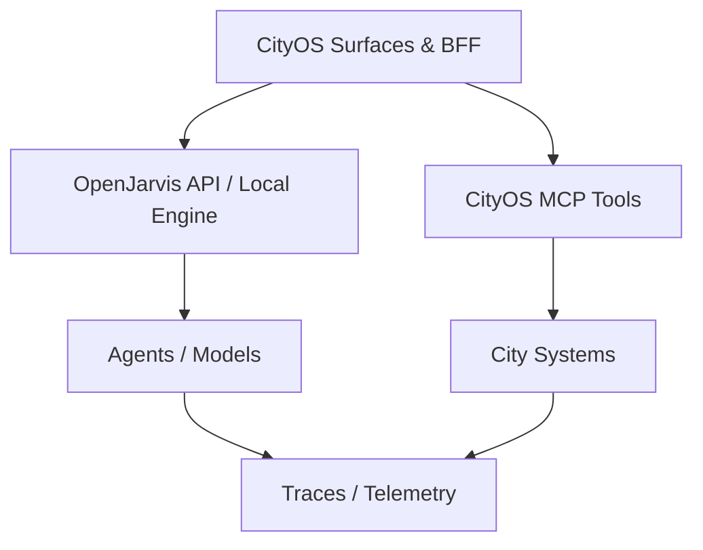

# CityOS Integrations

This documentation set describes how **Dakkah CityOS** — a Capability-Driven Surface Runtime Architecture for smart city commerce, governance, and citizen services — can use OpenJarvis as a local-first AI runtime, tool orchestrator, and policy-aware assistant layer.

## What CityOS Is

Dakkah CityOS is a large-scale monorepo platform with:

- **~120 domain packages** (`packages/domains/*`) — DDD bounded contexts covering commerce, healthcare, governance, transportation, fleet-logistics, security-services, public-safety, telemedicine, and more.
- **45 apps** — Next.js portals (citizen, merchant, government, business dashboards), Expo mobile apps (12 surfaces), Medusa v2 commerce backend, ERPNext/Tryton ERP, Fleetbase logistics, IoT backends, and BFF gateways.
- **Multi-tenancy** via a Node hierarchy: Global → Country → Region → City → Zone → POI → Tenant.
- **Server-Driven UI (SDUI)** protocol with 180+ blocks across 14 surfaces.
- **Auth & Identity** — Keycloak (OIDC/JWT, port 8080) + Walt.id (DID/Verifiable Credentials, port 7000) + custom RBAC.
- **Real-time** — Kuzzle (port 7512) + Ably for pub/sub and IoT event streaming.
- **Search & Storage** — Meilisearch (port 7700), MinIO S3-compatible object storage (port 9001).
- **Monitoring** — Prometheus (9090), Grafana (3030), Alertmanager (9093), Loki (3100), Jaeger (16686).

CityOS is built on **pnpm workspace**, TypeScript strict mode, Payload CMS 3 + Next.js 15, and Tailwind CSS 4.

## What this section covers

- How CityOS surfaces and BFF gateways talk to OpenJarvis over an OpenAI-compatible API.
- How CityOS services (~120 domains, 45 apps) can be exposed to OpenJarvis through MCP tools.
- How memory, channels, traces, and telemetry fit into a CityOS deployment across 5 Docker Compose projects.
- What compliance and governance controls should be documented before rollout — including Keycloak identity, Walt.id verifiable credentials, and tenant isolation.
- Which CityOS use cases are supported first and what each one needs.

## Recommended reading order

### Getting Started
1. [Integration Overview](integration/overview.md)
2. [OpenJarvis Runtime Integration](integration/openjarvis-runtime.md)
3. [MCP and Tool Integration](integration/mcp-tools.md)

### Technical Deep Dives
4. [SDUI and AI Block Generation](integration/sdui-ai-blocks.md)
5. [Mobile and Expo Integration](integration/mobile-expo-integration.md)
6. [Event-Driven Integration Patterns](integration/event-driven-patterns.md)

### Architecture & Security
7. [System Context and Architecture](architecture/system-context.md)
8. [Deployment Overview](deployment/overview.md)
9. [Compliance Overview](compliance/overview.md)

### Use Cases
10. [Use-Case Overview](use-cases/overview.md)
11. [Citizen Support Assistant](use-cases/citizen-support.md)
12. [Merchant Assistant](use-cases/merchant-assistant.md)
13. [Government Officer Assistant](use-cases/government-officer-assistant.md)
14. [Field Inspector Assistant](use-cases/field-inspector-assistant.md)
15. [Fleet Driver Assistant](use-cases/fleet-driver-assistant.md)
16. [Healthcare Assistant](use-cases/healthcare-assistant.md)
17. [Developer Assistant](use-cases/developer-assistant.md)
18. [Security and Compliance Assistant](use-cases/security-compliance-assistant.md)
19. [Internal Operations Assistant](use-cases/ops-assistant.md)

### Operations
20. [Operations Overview](operations/overview.md)
21. [Runbook](operations/runbook.md)
22. [Testing Strategy](operations/testing-strategy.md)

### Reference
23. [OpenJarvis Full Inventory](reference/openjarvis-inventory.md) — Complete app/component inventory and tech stack
24. [CityOS AI Gap Analysis](reference/cityos-ai-gap-analysis.md) — Detailed analysis of CityOS ai-assistant and voice-assistant vs. OpenJarvis
25. [Integration Strategy](reference/openjarvis-integration-strategy.md) — Monorepo vs. external vs. fork architectural decision
26. [Reference Glossary](reference/glossary.md)

## Documentation principles

- Treat security and compliance as first-class requirements, not appendices.
- Describe data flow, trust boundaries, and permissions explicitly — especially across the Node hierarchy and tenant boundaries.
- Keep every integration doc actionable: include prerequisites, configuration, validation, and failure modes.
- Prefer local-first and least-privilege defaults unless a CityOS use case requires otherwise.
- Respect domain boundaries: domains must not import from sibling domains directly; use `packages/domains/_shared/`, `packages/cityos-core/`, or events/outbox for cross-domain communication.

## Suggested scope for CityOS

- Citizen support and internal service desk assistance across the smart-city-portal and citizen mobile app.
- Merchant operations across mobile-merchant, business-dashboard, and POS surfaces.
- Government officer workflows across city-dashboard, mobile-government, and governance portal.
- Field inspection with offline-capable mobile inspector app.
- Fleet and driver logistics across mobile-driver and fleetops.
- Healthcare facility directory and appointment scheduling (non-PHI).
- Developer productivity across dev-portal and CityOS Studio.
- Security operations and compliance auditing via ops-helper-ui.
- Incident triage and routing for ops teams.
- Policy and procedure question answering.
- Scheduling, notification, and follow-up workflows tied to Temporal.io.
- Data lookup and summarization across approved CityOS systems via the BFF gateway.
- Voice assistant interactions through `apps/voice-assistant/`.
- AI-generated SDUI blocks across all 14 surfaces.

## Compliance note

These documents are implementation guidance, not legal advice. Final compliance language should be reviewed against CityOS policy, procurement rules, and any applicable public-sector or enterprise requirements. CityOS handles regulated data across healthcare, governance, and commerce domains — classify all data before it reaches OpenJarvis.
