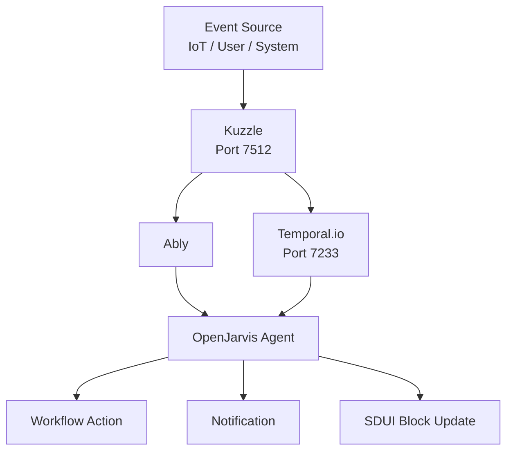

# Event-Driven Integration Patterns

> [← Back to Integration Overview](overview.md) · [← CityOS Integrations](../index.md)

CityOS uses Kuzzle, Ably, and Temporal.io for real-time communication, scheduling, and workflow orchestration. OpenJarvis can participate in these event-driven architectures as both a consumer and producer of events.

**Related**: [Integration Overview](overview.md) · [Mobile and Expo Integration](mobile-expo-integration.md) · [SDUI and AI Blocks](sdui-ai-blocks.md)



## Event infrastructure

| Service | Port | Purpose |
|---|---|---|
| Kuzzle | 7512 | Real-time pub/sub, IoT ingestion, document store |
| Ably | N/A (cloud/SaaS) | Reliable message delivery, presence, push |
| Temporal.io | 7233 | Durable workflow execution, scheduled tasks |

## Pattern 1: IoT telemetry → AI analysis

IoT devices send telemetry to `apps/kuzzle-iot-backend/`. OpenJarvis can:
- Subscribe to Kuzzle realtime channels for anomaly detection.
- Analyze telemetry streams (temperature, vibration, location) using local models.
- Trigger alerts or workflow actions when thresholds are exceeded.
- Generate natural language summaries for ops dashboards.

```
IoT Sensor → Kuzzle → OpenJarvis Monitor Agent → Temporal Workflow → Alert
```

## Pattern 2: Scheduled AI agents

Temporal.io runs scheduled workflows that invoke OpenJarvis:
- **Morning digest** (`apps/ai-assistant/` with `morning-digest` preset): Daily briefing from email, calendar, health, news.
- **Monitor operative** (`monitor_operative` agent): Persistent monitoring with memory, compression, and retrieval.
- **Compliance scanner**: Weekly RBAC audit report generation.
- **Analytics summarizer**: Nightly aggregation of citizen support metrics.

```
Temporal Schedule → Workflow → OpenJarvis Agent → BFF MCP Tools → Email/Slack
```

## Pattern 3: Real-time surface updates

When OpenJarvis completes a long-running task, push results to surfaces:
- Kuzzle publishes to a tenant-scoped channel.
- Mobile/web surfaces subscribe via Ably SDK.
- SDUI blocks update in real time without page refresh.

```
OpenJarvis → Kuzzle Channel → Ably → Citizen Portal / Mobile App
```

## Pattern 4: Event-sourced AI memory

OpenJarvis traces can be stored as Kuzzle documents for:
- Cross-session memory (what did this user ask yesterday?)
- Agent learning (which responses were rated helpful?)
- Audit replay (reconstruct the full decision sequence)

Use `packages/cityos-events/` for standardized event schemas.

## Implementation guidelines

### Kuzzle integration
- Use `packages/cityos-events/` event bus helpers.
- Create tenant-scoped channels: `cityos:<tenant-id>:ai:<agent-id>`.
- Implement ACL so users only receive events for their tenant.
- Set TTL on transient AI events (5 minutes for typing indicators, 24 hours for task status).

### Temporal integration
- Define workflows in `src/lib/workflow/temporal/`.
- Use `packages/cityos-workflows-sdk/` for TypeScript workflow definitions.
- Retry OpenJarvis calls with exponential backoff (max 5 attempts).
- Store workflow state in PostgreSQL (Temporal persistence).

### Ably integration
- Use Ably channels for reliable mobile push delivery.
- Implement presence detection (is the user online to receive AI response?).
- Fallback to email/SMS for critical alerts if push fails.

## Security considerations

- Validate event origin — reject unauthenticated Kuzzle messages.
- Sanitize event payloads before passing to OpenJarvis (prevent prompt injection).
- Encrypt sensitive event data at rest (Kuzzle document encryption).
- Audit all event-driven AI actions via Temporal workflow history.

## Failure modes

- If Kuzzle is unreachable, queue events in Redis (`cityos-infra`) with TTL.
- If Temporal workflow fails, alert ops and provide manual retry via ops-helper-ui.
- If Ably delivery fails, retry with backoff; escalate to SMS for critical alerts.
- If OpenJarvis analysis of IoT data is inconclusive, flag for human review rather than auto-acting.

---

## See also

- [Integration Overview](overview.md) — High-level integration patterns
- [Mobile and Expo Integration](mobile-expo-integration.md) — Push notifications and offline sync
- [SDUI and AI Blocks](sdui-ai-blocks.md) — Real-time block updates via Kuzzle
- [System Context](../architecture/system-context.md) — Network segmentation
- [Fleet Driver Assistant](../use-cases/fleet-driver-assistant.md) — IoT telemetry use case
- [Field Inspector Assistant](../use-cases/field-inspector-assistant.md) — Offline sync use case
