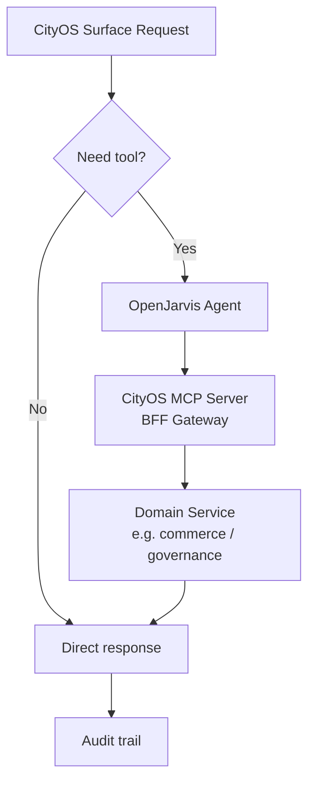

# MCP and Tool Integration

> [← Back to Integration Overview](overview.md) · [← CityOS Integrations](../index.md)

CityOS should expose business capabilities to OpenJarvis as tools rather than embedding those capabilities in prompts. With ~120 domain packages and 180+ SDUI blocks, CityOS has a rich catalog of capabilities that can be exposed through a structured MCP server.

**Related**: [Integration Overview](overview.md) · [OpenJarvis Runtime Integration](openjarvis-runtime.md) · [SDUI and AI Blocks](sdui-ai-blocks.md)

## Why MCP

- It gives OpenJarvis a structured tool catalog derived from CityOS domain boundaries.
- It keeps CityOS service boundaries explicit — each domain owns its own tools.
- It makes auditing and authorization easier because every tool call flows through the BFF gateway.
- It allows tool reuse across agents and use cases (citizen support, ops assistant, merchant dashboard).

## What to expose first

Start with read-only or low-risk tools from stable domains:

- **Governance**: policy search, permit status lookup, public record directory
- **Commerce**: product catalog search, order status lookup (Medusa v2), merchant directory
- **Healthcare**: facility directory, service availability (no patient data)
- **Transportation**: route lookup, transit schedule, parking availability
- **General**: CityOS Node hierarchy lookup (city/zone/POI), calendar read-only checks, ticket summarization

Add mutation tools only after you have:

- Identity propagation (Keycloak JWT with tenant claims)
- Explicit approval flow (RBAC `rbacChecker.ts` gates)
- Audit logging (BFF audit + OpenJarvis trace)
- Rollback or compensation strategy (CityOS rollback snapshots)

## MCP server guidance

A CityOS MCP server should document:

- Server name (e.g., `cityos-governance-mcp`, `cityos-commerce-mcp`)
- Transport type (stdio for local, HTTP/SSE for remote)
- Authentication method (Bearer JWT from Keycloak, validated by BFF `withBff()`)
- Tool allowlist and denylist per RBAC role
- Input schema for each tool (Zod schemas preferred, matching CityOS contracts)
- Output schema for each tool
- Rate limits and timeout behavior
- Operational ownership (which domain team maintains the tool)

## Domain-to-tool mapping example

| Domain | Tool Name | Risk Level | Notes |
|---|---|---|---|
| `governance` | `lookup_permit_status` | read-only | Public records |
| `governance` | `submit_permit_application` | approval-required | Requires citizen identity + RBAC |
| `commerce` | `search_products` | read-only | Medusa v2 catalog |
| `commerce` | `check_order_status` | read-only | Order ID + tenant filter |
| `healthcare` | `find_facility` | read-only | No patient data |
| `transportation` | `get_route` | read-only | PostGIS routing |
| `cityos-core` | `resolve_node` | read-only | Node hierarchy lookup |

## Security and governance

- Never expose secrets directly through tool output. The BFF gateway redacts sensitive fields.
- Redact personal or regulated data unless the use case explicitly allows it. Healthcare domain tools must never return PHI without explicit authorization.
- Treat tool arguments as untrusted input. Validate all identifiers, timestamps, and free-text filters with Zod schemas.
- Make mutation tools require stronger permissions than lookup tools. Use RBAC tiers: read-only → low-risk write → approval-required write → privileged/irreversible.
- Enforce tenant isolation in every tool. A tool must validate that the requested resource belongs to the caller's Node (tenant) in the hierarchy.

## Operational pattern

1. CityOS surface receives a user request.
2. BFF gateway authenticates the user via Keycloak JWT and checks RBAC.
3. BFF decides whether a tool is needed and forwards to OpenJarvis.
4. OpenJarvis agent calls the MCP tool.
5. CityOS MCP server validates the request (auth, tenant, input schema).
6. Domain service executes the logic.
7. CityOS validates the result and redacts if needed.
8. CityOS stores the decision and response in its own audit trail.
9. OpenJarvis stores the trace for debugging and optimization.

## Minimum documentation for each tool

- Purpose
- Owner domain team
- Inputs (Zod schema reference)
- Outputs
- Required RBAC permissions
- Risk level
- Failure handling
- Retention and logging behavior

---

## See also

- [Integration Overview](overview.md) — Primary integration surfaces
- [OpenJarvis Runtime Integration](openjarvis-runtime.md) — API connection and request profiles
- [SDUI and AI Blocks](sdui-ai-blocks.md) — Block generation from tool results
- [Authorization and Audit](../compliance/authorization-audit.md) — RBAC enforcement patterns
- [Use-Case Overview](../use-cases/overview.md) — Domain-specific tool usage by persona
