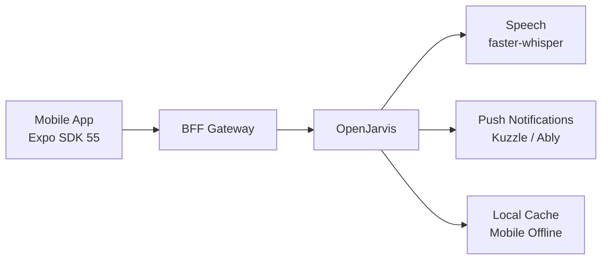

# Mobile and Expo Integration

> [← Back to Integration Overview](overview.md) · [← CityOS Integrations](../index.md)

CityOS runs 12 mobile applications on Expo SDK 55 and React Native 0.83.6. OpenJarvis can power AI features across all mobile surfaces — citizen app, merchant app, driver app, government app, inspector app, POS, and the superapp.

**Related**: [Integration Overview](overview.md) · [Event-Driven Patterns](event-driven-patterns.md) · [SDUI and AI Blocks](sdui-ai-blocks.md)



## Mobile apps in CityOS

| App | Package | Primary Users |
|---|---|---|
| Citizen app | `apps/mobile/` | General public |
| Merchant app | `apps/mobile-merchant/` | Business owners |
| Driver app | `apps/mobile-driver/` | Fleet drivers |
| Government app | `apps/mobile-government/` | City officers |
| Inspector app | `apps/mobile-inspector/` | Field inspectors |
| POS | `apps/mobile-pos/` | Retail staff |
| Superapp | `apps/superapp/` | All-in-one citizen experience |

## Integration architecture

### API consumption
Mobile apps call OpenJarvis through the BFF gateway, not directly:
```
Mobile App → BFF Gateway → OpenJarvis /v1/chat/completions
```
This ensures:
- Authentication via Keycloak JWT
- RBAC enforcement
- Data classification and redaction
- Audit logging

### Voice input
Use OpenJarvis with the `speech` extra (`faster-whisper`) for voice commands:
- Record audio on mobile using Expo AV
- Stream to OpenJarvis for transcription
- Send transcribed text to chat API
- Receive TTS audio back for hands-free responses

### Offline support
`packages/mobile-offline/` provides:
- Local SQLite database for cached AI responses
- Queue for requests made while offline
- Background sync when connectivity returns
- Conflict resolution for AI-generated content

### Push notifications
Kuzzle (port 7512) and Ably deliver real-time notifications:
- AI task completion alerts
- Scheduled agent reminders (morning digest, monitor alerts)
- Escalation notifications requiring human action

## Native module considerations

Expo SDK 55 with React Native 0.83.6 requires:
- EAS builds configured per-app in `apps/<app>/eas.json`
- Native module changes may require `pnpm postinstall`
- `react-native-reanimated` for smooth AI response animations
- `react-native-vision-camera` for inspector photo capture

## Security on mobile

- Store OpenJarvis API keys in native secure storage (iOS Keychain / Android Keystore), not AsyncStorage.
- Validate SSL pinning for BFF gateway connections.
- Implement certificate transparency for production builds.
- Never cache PHI or regulated data in offline storage without encryption.
- Use `expo-secure-store` for JWT tokens and refresh tokens.

## Performance guidelines

- AI response streams should use chunked transfer encoding via SSE.
- Implement request debouncing (300ms) for voice transcription.
- Cache SDUI block responses for 5 minutes to reduce round-trips.
- Use `react-native-svg` for rendering AI-generated charts locally.
- Monitor bundle size impact — AI features should add <2MB to the app binary.

## Testing

- Use `jest-expo` for unit testing AI integration hooks.
- Use Maestro or Detox for E2E testing of voice flows.
- Mock OpenJarvis API in tests with `msw` (Mock Service Worker).
- Test offline behavior by enabling airplane mode during test scenarios.

## Failure modes

- If the BFF gateway is unreachable, queue the request and show offline indicator.
- If voice transcription fails, fall back to text input with the last recognized partial transcript.
- If AI response streaming is interrupted, show cached partial response with "Continue" button.
- If push notification delivery fails, retry via Kuzzle's built-in retry mechanism.

---

## See also

- [Integration Overview](overview.md) — High-level integration surfaces
- [Event-Driven Patterns](event-driven-patterns.md) — Kuzzle and Ably real-time patterns
- [SDUI and AI Blocks](sdui-ai-blocks.md) — Block rendering on mobile surfaces
- [Citizen Support Assistant](../use-cases/citizen-support.md) — Mobile citizen use case
- [Fleet Driver Assistant](../use-cases/fleet-driver-assistant.md) — Voice-first driver use case
- [Field Inspector Assistant](../use-cases/field-inspector-assistant.md) — Offline-capable inspection use case
