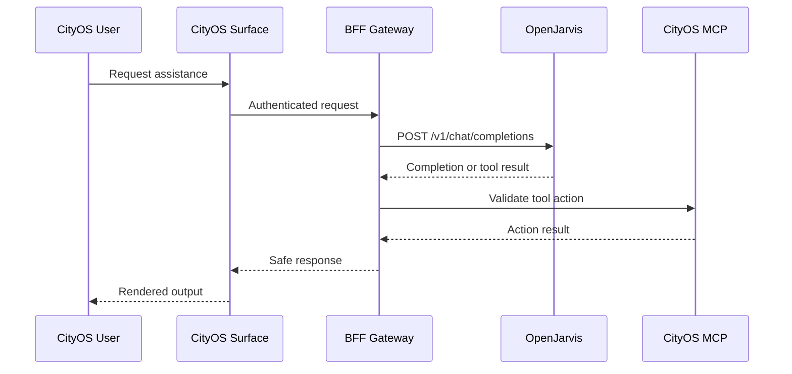

# OpenJarvis Runtime Integration

> [← Back to Integration Overview](overview.md) · [← CityOS Integrations](../index.md)

This document defines the recommended way for CityOS to consume OpenJarvis as a runtime service. CityOS runs 45 apps across web, mobile, kiosk, TV, watch, and car surfaces; the AI assistant and voice assistant surfaces are the primary OpenJarvis consumers.

**Related**: [Integration Overview](overview.md) · [MCP and Tool Integration](mcp-tools.md) · [Mobile and Expo Integration](mobile-expo-integration.md)

## Connection model

Use the OpenJarvis API server as an internal AI service. CityOS should send requests to the OpenAI-compatible chat endpoint and handle the response as an assistant completion or tool-assisted result.

Relevant OpenJarvis behavior:

- `POST /v1/chat/completions` supports standard chat payloads.
- Streaming responses use SSE.
- When an agent is configured, non-streaming requests can be routed through the agent layer.
- API access can be protected with `Authorization: Bearer <key>` when the server is bound beyond localhost.

## CityOS responsibilities

- Build the system prompt and user message payload. Include the Node context (tenant, city, zone) if relevant.
- Decide whether the request is read-only, tool-enabled, or restricted. The BFF gateway's `rbacChecker.ts` enforces this server-side.
- Map CityOS user identity (Keycloak OIDC JWT) to a server-side authorization policy. The JWT contains roles and tenant claims.
- Enforce data classification before sending content to OpenJarvis. Do not send regulated health, financial, or PII data unless explicitly approved and redacted.
- Log the request and the result in CityOS audit storage. The BFF gateway writes audit logs; OpenJarvis writes traces.
- Handle tenant isolation. Every query must include the tenant context from the Node hierarchy so OpenJarvis tools filter data correctly.

## Configuration guidance

- Prefer a dedicated CityOS service account or application identity in Keycloak.
- Keep the OpenJarvis API key in the CityOS secret store (e.g., injected via `.env.vps` and `envValidator.ts`), not in source control.
- Bind the OpenJarvis server to localhost for single-machine development.
- Use a private network or reverse proxy with authentication for shared environments. The CityOS BFF gateway already acts as this proxy for frontend surfaces.
- If running OpenJarvis in a container, place it in the `cityos-apps-backend` or `cityos-helpers` Docker Compose project for network isolation.

## Request profile

Each CityOS integration should document:

- Target model (e.g., local MLX on Apple Silicon, vLLM on GPU, or cloud fallback).
- Target agent (e.g., `orchestrator` for multi-turn reasoning, `simple` for single-turn chat).
- Temperature and token limits.
- Tool list or tool policy (which of the 66 domains' tools are available).
- Streaming or non-streaming mode.
- Data classification of the request (public, internal, restricted, regulated).
- Fallback behavior if OpenJarvis is unavailable (e.g., return a static SDUI error block, queue for retry).

## Local-first model strategy

CityOS aligns with OpenJarvis's local-first philosophy:

- Use local models (MLX on macOS, vLLM on Linux GPU, Ollama on CPU) for 88.7% of single-turn queries.
- Call cloud APIs only when the local model confidence is below threshold or the query requires a model not available locally.
- The `apps/ai-assistant/` surface can route to OpenJarvis local engine by default and fail over to cloud engines via the `inference-cloud` extra.

## Failure modes

- **Authentication failure**: reject the request and do not retry silently. Return an SDUI error block to the surface.
- **Model unavailable**: use a documented fallback model or fail closed. Log the failure to Prometheus/Grafana.
- **Agent error**: capture the error and return a safe user-facing message. Do not expose stack traces or internal paths.
- **Timeout**: cancel the request and record the timeout threshold used. The BFF gateway should have a configured timeout (default 30s).
- **Tenant isolation breach**: if a tool returns data for the wrong tenant, abort the response and alert ops via the ops-helper-ui alert stream.

---

## See also

- [Integration Overview](overview.md) — High-level integration surfaces
- [MCP and Tool Integration](mcp-tools.md) — Tool catalog and security governance
- [Mobile and Expo Integration](mobile-expo-integration.md) — Mobile-specific connection patterns
- [SDUI and AI Blocks](sdui-ai-blocks.md) — Rendering AI responses as blocks
- [System Context](../architecture/system-context.md) — Trust boundaries and network segmentation
