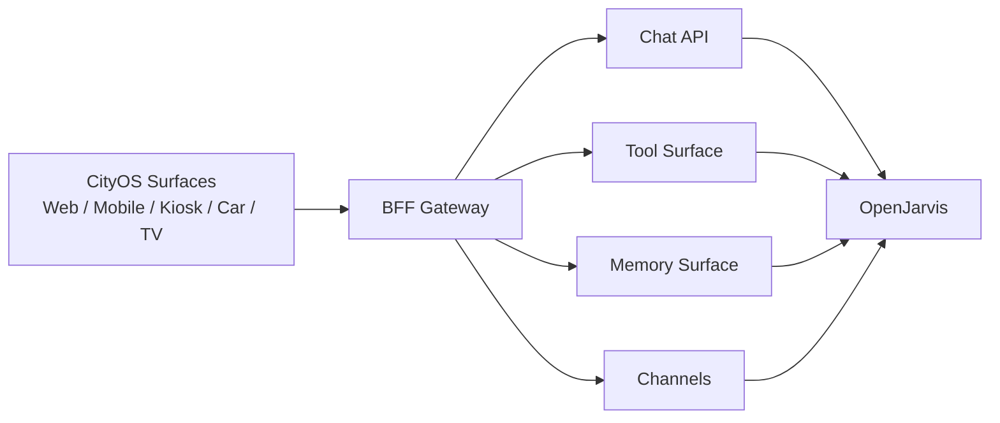

# Integration Overview

> [← Back to CityOS Integrations](../index.md)

CityOS should integrate with OpenJarvis through a small number of stable interfaces so the rest of the system stays replaceable. CityOS is a Capability-Driven Surface Runtime Architecture — surfaces render SDUI blocks, and capabilities are provided by domain packages behind BFF gateways.

**Related**: [OpenJarvis Runtime Integration](openjarvis-runtime.md) · [MCP and Tool Integration](mcp-tools.md) · [SDUI and AI Blocks](sdui-ai-blocks.md)

## Primary integration surfaces

- **Chat API**: CityOS surfaces and BFF gateways call OpenJarvis through the OpenAI-compatible `/v1/chat/completions` endpoint. The `apps/ai-assistant/` and `apps/voice-assistant/` surfaces are the primary consumers.
- **Tool surface**: CityOS capabilities from the 66 domain packages are exposed as MCP tools or local tools discovered by OpenJarvis. Examples: governance permit lookup, commerce order status, healthcare facility directory, transportation routing.
- **Memory surface**: approved CityOS documents, policy PDFs, and knowledge bases from `packages/domains/*/src/seed/` can be indexed for retrieval via the Rust extension's memory index.
- **Channel surface**: CityOS can send and receive notifications through messaging backends (Slack, Discord, Telegram, email) already configured in OpenJarvis channels.
- **Telemetry and traces**: execution data is recorded locally for debugging, evaluation, and optimization. CityOS operators can review traces in the OpenJarvis trace store or forward them to the existing Prometheus/Grafana/Loki stack.

## Integration goals

- Keep CityOS application code free from model-specific assumptions. The SDUI protocol already abstracts rendering; the AI layer should abstract model choice.
- Keep all CityOS-to-AI interactions auditable through the BFF gateway's `withBff()` wrapper and `rbacChecker.ts` RBAC enforcement.
- Avoid duplicating business logic inside prompts when the logic belongs in a domain service or tool. Use the 66 domain packages as the source of truth.
- Make sensitive operations explicit, permissioned, and observable. Every BFF route must check RBAC server-side; never trust client-side role checks.

## Recommended architecture

- **CityOS owns** business workflows, identity (Keycloak / Walt.id), authorization (RBAC), multi-tenancy (Node hierarchy), and persistence (PostgreSQL + PostGIS, MinIO).
- **OpenJarvis owns** model routing, agent orchestration, tool dispatch, and retrieval augmentation.
- **A CityOS MCP service** exposes city functions such as lookup, routing, reporting, and workflow actions. This service runs as part of the `cityos-bff` compose project or as a dedicated container in `cityos-apps-backend`.
- **OpenJarvis uses those tools** when the agent is allowed to act, respecting the permission tiers defined in `docs/RBAC_AND_ROLES_SPECIFICATION.md`.
- **Data classification happens at the BFF boundary** before any content is sent to OpenJarvis. The BFF gateway validates tenant isolation and RBAC; classified data is filtered or redacted there.

## Integration points in the monorepo

| CityOS Component | OpenJarvis Integration Point | Notes |
|---|---|---|
| `apps/ai-assistant/` | Chat API + MCP tools | Primary AI surface |
| `apps/voice-assistant/` | Chat API (streaming) | Voice-to-text via faster-whisper |
| `apps/bff-gateway/` | MCP server host | Exposes domain tools securely |
| `packages/domains/*` | Tool implementations | Each domain can register MCP tools |
| `packages/cityos-events/` | Event bus for async triggers | Scheduler agents, digest agents |
| `src/app/api/bff/` | BFF route handlers | `withBff()` wrapper enforces auth |

## Documentation checklist for any new integration

- What system owns the data (usually a CityOS domain package).
- What system initiates the action (surface → BFF → OpenJarvis, or scheduler → OpenJarvis → BFF).
- Which identity is used (Keycloak OIDC JWT, mapped to CityOS RBAC roles).
- Which permissions are required (from `docs/RBAC_AND_ROLES_SPECIFICATION.md`).
- Whether the action is read-only or mutating.
- What is logged (BFF audit log + OpenJarvis trace).
- What happens when the tool or model fails.
- Whether the operation can be replayed or rolled back (CityOS rollback snapshots in `/opt/dakkah-cityos-platform/rollbacks/`).

---

## See also

- [OpenJarvis Runtime Integration](openjarvis-runtime.md) — API connection model
- [MCP and Tool Integration](mcp-tools.md) — Tool catalog and governance
- [SDUI and AI Blocks](sdui-ai-blocks.md) — AI-generated block rendering
- [Mobile and Expo Integration](mobile-expo-integration.md) — Mobile surface integration
- [Event-Driven Patterns](event-driven-patterns.md) — Real-time event architecture
- [System Context](../architecture/system-context.md) — Architecture and trust boundaries
