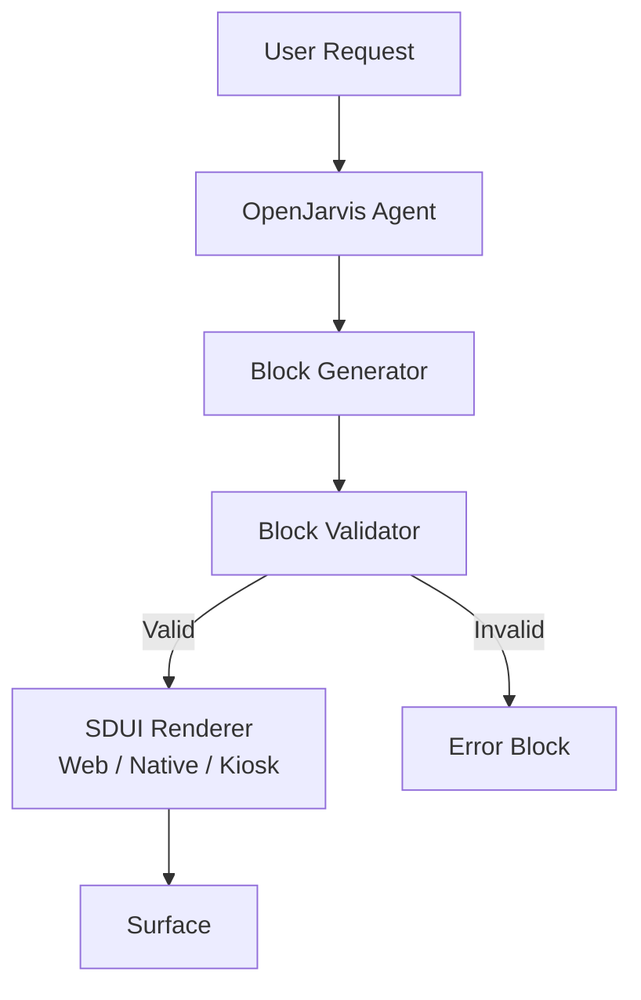

# SDUI and AI Block Generation

> [← Back to Integration Overview](overview.md) · [← CityOS Integrations](../index.md)

CityOS uses a Server-Driven UI (SDUI) protocol with 180+ blocks across 14 surfaces. OpenJarvis can generate, augment, and validate SDUI blocks dynamically — enabling AI-powered user experiences that adapt to context.

**Related**: [Integration Overview](overview.md) · [MCP and Tool Integration](mcp-tools.md) · [Mobile and Expo Integration](mobile-expo-integration.md)



## SDUI protocol overview

CityOS SDUI consists of:
- **Block definitions** in `packages/domains/<domain>/src/blocks/` — TypeScript schemas describing UI primitives.
- **Renderers** in `packages/sdui-renderer-web/`, `packages/sdui-renderer-native/`, etc. — surface-specific implementations.
- **Block registry** — each domain registers blocks in its block index.
- **180+ blocks** across commerce, governance, healthcare, transportation, and other domains.

## How OpenJarvis generates blocks

1. **User intent parsing** — OpenJarvis understands the request (e.g., "Show me a product comparison").
2. **Block selection** — OpenJarvis selects appropriate blocks from the catalog:
   - `ProductCardBlock` for product display
   - `ComparisonTableBlock` for side-by-side comparison
   - `PriceBlock` for pricing information
   - `ActionBlock` for "Add to Cart" or "Buy Now"
3. **Data binding** — OpenJarvis calls MCP tools to fetch data (Medusa product API, etc.).
4. **Block assembly** — OpenJarvis assembles a block tree with validated props.
5. **Validation** — Blocks are validated against Zod schemas before rendering.
6. **Rendering** — The SDUI renderer converts blocks to React / React Native / SwiftUI components.

## Supported surfaces

| Surface | Renderer Package | Block Count |
|---|---|---|
| Web | `packages/sdui-renderer-web/` | 180+ |
| Mobile (Expo) | `packages/sdui-renderer-native/` | 180+ |
| Kiosk | `packages/sdui-renderer-kiosk/` | Core subset |
| TV | `packages/sdui-renderer-tv/` | Simplified |
| Watch | `packages/sdui-renderer-watch/` | Minimal |
| Car | `packages/sdui-renderer-car/` | Safety-optimized |
| Headless | `packages/sdui-renderer-headless/` | Voice / API only |

## AI-augmented block types

### Dynamic content blocks
OpenJarvis can populate blocks with AI-generated content:
- `TextBlock` — summaries, explanations, translations
- `RichTextBlock` — formatted responses with markdown
- `ImageBlock` — AI-generated images (if media extra is enabled)
- `ChartBlock` — data visualizations from queried metrics

### Conversational blocks
- `ChatBubbleBlock` — threaded conversation UI
- `SuggestionChipBlock` — context-aware next actions
- `FormBlock` — dynamic forms generated from user intent

### Adaptive blocks
OpenJarvis can adapt block layout based on:
- Surface capabilities (screen size, input methods)
- User preferences (language, accessibility settings)
- Context (time of day, location, tenant)

## Block validation pipeline

Every AI-generated block must pass:

1. **Schema validation** — `zod` schemas from `packages/sdui-protocol/`.
2. **Design governance** — `pnpm design:audit:blocks` checks token compliance, contrast, size limits.
3. **Security scan** — No hardcoded secrets, no XSS vectors in text content.
4. **Accessibility check** — ARIA labels, color contrast, screen reader support via `accessibility-compliance` skill.

## Implementation pattern

```typescript
// BFF gateway route
import { withBff } from "@/lib/bff/withBff";
import { generateBlocks } from "@/lib/sdui/ai-generator";

export const POST = withBff(async (req, ctx) => {
  const { intent, surface } = await req.json();
  const blocks = await generateBlocks(intent, surface, ctx.user);
  return Response.json({ blocks });
});
```

## Performance considerations

- Block generation should complete within 2 seconds for responsive UX.
- Cache common block patterns in Redis (part of `cityos-infra`).
- Use streaming for large block trees — send header blocks first, details progressively.
- Run `pnpm design:audit:size` to check bundle impact of new AI-generated block types.

## Failure modes

- If block generation fails validation, return a fallback `ErrorBlock` with user-friendly message.
- If the surface doesn't support a requested block type, return a compatible alternative.
- If AI-generated content is rejected by design governance, log the violation and fall back to static content.
- If OpenJarvis is unavailable, surfaces should render cached static blocks or skeleton loaders.

---

## See also

- [Integration Overview](overview.md) — High-level integration surfaces
- [MCP and Tool Integration](mcp-tools.md) — Tool-to-block data binding
- [Mobile and Expo Integration](mobile-expo-integration.md) — Block rendering on mobile
- [Event-Driven Patterns](event-driven-patterns.md) — Real-time block updates
- [Developer Assistant](../use-cases/developer-assistant.md) — Block scaffolding use case
- [Use-Case Overview](../use-cases/overview.md) — All AI-powered surfaces
