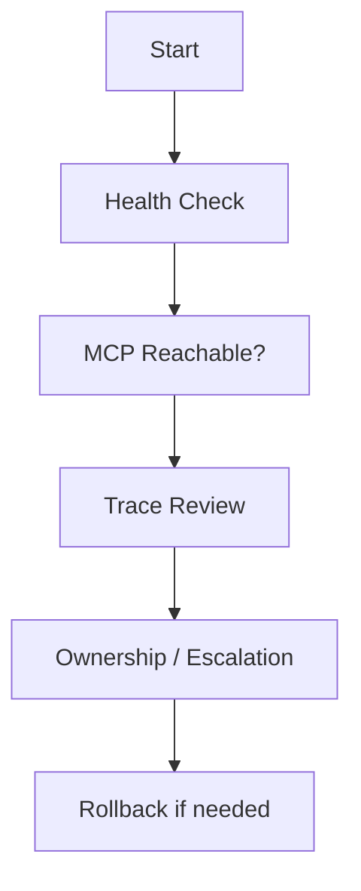

# Operations Overview

> [← Back to CityOS Integrations](../index.md)

CityOS operators should document how the OpenJarvis integration is run, monitored, and recovered. CityOS runs a comprehensive observability stack across 5 Docker Compose projects.

**Related**: [Runbook](runbook.md) · [Testing Strategy](testing-strategy.md) · [Deployment Overview](../deployment/overview.md)

## Operational topics

- Service startup and shutdown across 5 compose projects.
- Model and engine availability (local MLX, vLLM, Ollama, or cloud fallback).
- Secret rotation (Keycloak, database, MinIO, OpenJarvis API key).
- Logging and tracing (Loki, Jaeger, OpenJarvis trace store).
- Backup and restore (PostgreSQL dumps, MinIO bucket replication, rollback snapshots).
- Incident response (ops-helper-ui alerts, Prometheus alerting, Grafana dashboards).
- Version upgrades (pnpm workspace, Docker images, OpenJarvis models).
- Rollback process (CityOS rollback snapshots, compose project revert).

## Monitoring stack

CityOS exposes the following observability services:

| Service | Port | Purpose |
|---|---|---|
| Prometheus | 9090 | Metrics collection |
| Grafana | 3030 | Dashboards and visualization |
| Alertmanager | 9093 | Alert routing and notification |
| Loki | 3100 | Log aggregation |
| Jaeger | 16686 | Distributed tracing |

OpenJarvis traces and telemetry can be scraped by Prometheus or forwarded to Loki for centralized log analysis.

## Routine checks

- Confirm the OpenJarvis health endpoint is green (`curl http://localhost:8000/health`).
- Verify MCP servers are reachable from the BFF gateway.
- Verify the CityOS tool catalog is loaded correctly (no missing domain registrations).
- Review audit logs for denied or unusual actions (BFF audit store, ops-helper-ui alerts).
- Confirm storage growth is within expected limits (PostgreSQL, MinIO, OpenJarvis trace DB).
- Review Prometheus targets for all 5 compose projects.
- Check Grafana dashboards for payload-cms, medusa-backend, and BFF gateway latency.

## Ops-helper container

The `cityos-ops-helper` container is the CLI toolbox for CityOS operations. It provides 35+ commands including:

- `deploy` — trigger GitHub Actions deploy workflows
- `rollback` — create and restore rollback snapshots
- `health` — check service health across compose projects
- `audit` — run audit suites (collections, API routes, surfaces)
- `seed` — CMS seed and database readiness
- `vendor-tests` — run ERPNext, Tryton, Fleetbase test suites

OpenJarvis can query ops-helper output via the ops-helper-ui API or MCP tools.

## Operational ownership

Document which team owns:

- The OpenJarvis service (AI/ML team)
- The CityOS MCP server (platform engineering / BFF team)
- The model runtime (infrastructure or AI team)
- The secret store (security team — Keycloak + `.env.vps`)
- The audit log store (compliance team — BFF audit + OpenJarvis traces)
- The compliance review process

---

## See also

- [Runbook](runbook.md) — Common incidents and recovery guidance
- [Testing Strategy](testing-strategy.md) — Test pyramid for AI integrations
- [Deployment Overview](../deployment/overview.md) — Deployment patterns and compose projects
- [System Context](../architecture/system-context.md) — Network segmentation and monitoring placement
- [Internal Operations Assistant](../use-cases/ops-assistant.md) — Ops team AI use case (legal/compliance + domain owners)
- The ops-helper-ui and deploy agent (DevOps / SRE team)
