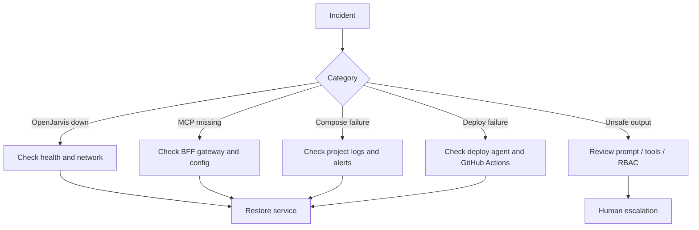

# Runbook

> [← Back to Operations Overview](overview.md) · [← CityOS Integrations](../index.md)

**Related**: [Operations Overview](overview.md) · [Testing Strategy](testing-strategy.md) · [Deployment Overview](../deployment/overview.md)

## Common incidents

### OpenJarvis is unreachable

- Check service health: `curl http://localhost:8000/health`.
- Check Docker container status: `docker ps | grep openjarvis`.
- Check port and network rules (is the container in the correct `cityos-apps-backend` network?).
- Check whether the API key was rotated (verify `.env.vps` and `envValidator.ts`).
- Check whether the model runtime is alive (Ollama, vLLM, or MLX process).
- Check Prometheus targets for OpenJarvis metrics endpoint.

### MCP tools are missing

- Confirm the CityOS MCP server container is running in `cityos-bff`.
- Confirm the server config is valid (tool schemas, transport type, auth method).
- Confirm the BFF gateway can reach the MCP server (network connectivity).
- Confirm the tool allowlist in `rbacChecker.ts` is not too restrictive.
- Confirm the tool is discoverable by the runtime (registered in domain index).
- Review BFF gateway logs in Loki for connection errors.

### Responses look wrong or unsafe

- Check the prompt and tool inputs in the OpenJarvis trace store.
- Check whether sensitive data was filtered at the BFF gateway.
- Check whether the correct agent and model were selected (orchestrator vs. simple).
- Check the RBAC role of the user — did they have access to the data returned?
- Escalate to a human reviewer if the action is high risk or involves regulated data.
- Review the alert in ops-helper-ui (`/alerts`) for related job failures.

### Docker Compose project failure

- Check which of the 5 projects is failing: `cityos-infra`, `cityos-apps-backend`, `cityos-apps-surfaces`, `cityos-bff`, `cityos-helpers`.
- Review container logs: `docker compose -p <project> logs --tail 100 <service>`.
- Check for health status changes in the ops-helper-ui SSE stream (`/api/docker/events`).
- Verify resource usage (disk, memory, load) in Grafana or ops-helper-ui Metrics page.
- If a service is unhealthy, use the per-service compose action API to restart it.
- If multiple services fail, check PostgreSQL and Redis health first (`cityos-infra`).

### Deploy agent or GitHub Actions failure

- Check the deploy agent (`webhook-server-v3.py` on port 9999) is running.
- Review GitHub workflow run details in ops-helper-ui (`/deployments/workflows/[id]`).
- Check job logs for the specific failed step.
- Verify the rollback snapshot was created before the failed deploy.
- If needed, restore the last known-good rollback snapshot via `/api/rollback/[id]`.
- Alert the DevOps team via the ops-helper-ui alert bell or Alertmanager.

### Medusa / Payload sync issues

- Check `medusa-backend` container health in `cityos-apps-backend`.
- Check `payload-cms` container health and migration status.
- Run `pnpm payload migrate` if migrations are pending.
- Verify Medusa module bridge (`packages/module-medusa/`) and Payload module bridge (`packages/module-payload/`) are up to date.
- Check BFF commerce gateway logs for API contract mismatches.

## Recovery guidance

- Prefer rollback over ad hoc fixes for release issues. CityOS keeps the last 10 rollback snapshots in `/opt/dakkah-cityos-platform/rollbacks/`.
- Capture the request ID, model, tool calls, and timestamps from OpenJarvis traces.
- Preserve evidence before changing configuration if the incident involves compliance or security.
- Use the ops-helper-ui job stream (`/api/jobs/[id]/stream`) to monitor recovery operations in real time.
- Document the incident in the runbook and update the ops-helper-ui alert store if a new failure pattern is detected.

---

## See also

- [Operations Overview](overview.md) — Monitoring stack and routine checks
- [Testing Strategy](testing-strategy.md) — Failure testing patterns
- [Deployment Overview](../deployment/overview.md) — Rollback procedures
- [System Context](../architecture/system-context.md) — Threat model and incident categories
- [Internal Operations Assistant](../use-cases/ops-assistant.md) — AI-assisted incident triage
