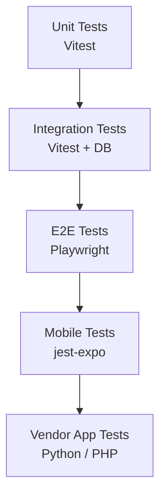

# Testing Strategy

> [← Back to Operations Overview](overview.md) · [← CityOS Integrations](../index.md)

CityOS uses Vitest, Playwright, and jest-expo for testing. OpenJarvis integrations must follow the same testing standards: 70% lines, 70% functions, 60% branches coverage.

**Related**: [Operations Overview](overview.md) · [Runbook](runbook.md) · [Local and Container Deployment](../deployment/local-and-container.md)



## Test pyramid for AI integrations

### Level 1: Unit tests (Vitest)
Test business logic in isolation:
- Data classification functions (redaction, PHI detection)
- RBAC permission mapping
- Block validation schemas
- MCP tool input/output transformers
- Schedule parsing (`lib/scheduler.ts`)

Example:
```typescript
import { describe, it, expect } from "vitest";
import { classifyData } from "@/lib/compliance/classifier";

describe("classifyData", () => {
  it("blocks PHI by default", () => {
    const result = classifyData({ ssn: "123-45-6789" });
    expect(result.allowed).toBe(false);
    expect(result.category).toBe("regulated");
  });
});
```

### Level 2: Integration tests (Vitest + PostgreSQL)
Test OpenJarvis + CityOS service interactions:
- BFF gateway routes with `withBff()` wrapper
- MCP tool calls against real domain services
- Database query correctness with tenant isolation
- Event publishing to Kuzzle
- Workflow execution via Temporal test server

Setup:
- Use `docker compose up postgres redis` for test infrastructure.
- Run `pnpm payload migrate` before test suite.
- Mock OpenJarvis API with `msw` or local Ollama test model.

### Level 3: E2E tests (Playwright)
Test complete user flows:
- Citizen asks support question → receives SDUI response
- Merchant checks inventory → sees product list
- Officer updates case → audit log is written
- Inspector uploads photo → syncs to MinIO

Key E2E scenarios:
| Flow | Test |
|---|---|
| Citizen support chat | Portal → BFF → OpenJarvis → MCP → Response |
| Merchant order lookup | Dashboard → BFF → Medusa → Summary |
| Government permit search | Portal → BFF → Payload → Policy result |
| Offline inspector sync | Mobile → Queue → Online → Sync |

### Level 4: Mobile tests (jest-expo)
Test Expo-specific AI features:
- Voice input transcription accuracy
- Offline cache behavior
- Push notification delivery
- SDUI block rendering on React Native

## Mocking strategies

### Mock OpenJarvis API
```typescript
// mocks/openjarvis.ts
export const mockOpenJarvis = {
  chat: vi.fn().mockResolvedValue({
    choices: [{ message: { content: "Test response" } }]
  }),
  tools: vi.fn().mockResolvedValue([]),
};
```

### Mock local models
Use Ollama with a tiny test model (`qwen2:0.5b`) for fast, deterministic responses in CI:
```bash
ollama pull qwen2:0.5b
OLLAMA_MODEL=qwen2:0.5b pnpm test:integration
```

### Mock MCP servers
Implement stub MCP servers in `tests/fixtures/mcp/` that return canned responses for each domain.

## CI integration

CityOS CI runs tests via `.github/workflows/integration-tests.yml` and `.github/workflows/pr-checks.yml`:

```yaml
# Suggested addition to pr-checks.yml
- name: AI Integration Tests
  run: |
    docker compose up -d postgres redis
    pnpm payload migrate
    pnpm test:integration --grep "openjarvis"
```

## Performance testing

- Measure OpenJarvis response latency under load (100 concurrent requests).
- Track token usage and cost for cloud fallback scenarios.
- Monitor GPU memory usage for local vLLM/MLX models.
- Use the `bench` module (`tests/bench/`) for latency, throughput, and energy metrics.

## Security testing

- Run `pnpm audit:security` before each release.
- Test prompt injection resistance with adversarial inputs.
- Verify tenant isolation with cross-tenant data access attempts.
- Confirm PHI blocking with synthetic health data.
- Test RBAC bypass attempts (missing JWT, wrong role, expired token).

## Failure testing

- Kill OpenJarvis container mid-request → verify graceful degradation.
- Disconnect Kuzzle → verify offline queue behavior.
- Corrupt MCP response → verify error handling and SDUI fallback blocks.
- Exhaust GPU memory → verify CPU fallback or error message.

## Coverage requirements

All AI integration code must meet CityOS thresholds:
- **70% lines**
- **70% functions**
- **60% branches**

Exclude from coverage:
- OpenJarvis vendor code (not owned by CityOS)
- Generated block scaffolding (tested via integration)
- Mock fixtures

---

## See also

- [Operations Overview](overview.md) — Monitoring and operational ownership
- [Runbook](runbook.md) — Failure testing and incident scenarios
- [Local and Container Deployment](../deployment/local-and-container.md) — Local test environment setup
- [Integration Overview](../integration/overview.md) — Integration surfaces to test
- [Developer Assistant](../use-cases/developer-assistant.md) — Code generation testing
