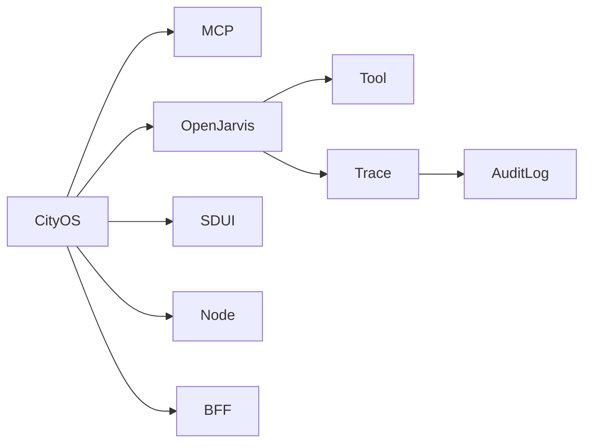

# Glossary

> [← Back to CityOS Integrations](../index.md)

## CityOS

The Dakkah City platform — a Capability-Driven Surface Runtime Architecture for smart city commerce, governance, and citizen services. It comprises ~120 domain packages, 45 apps, and a multi-tenant Node hierarchy.

## OpenJarvis

A local-first AI runtime that provides model routing, agent orchestration, tools, memory, traces, and telemetry. Consumed by CityOS as an internal AI service.

## MCP

Model Context Protocol. A standard way to expose tools to AI systems. CityOS exposes domain capabilities to OpenJarvis through MCP servers hosted in the BFF gateway.

## Tool

A callable capability that an agent can invoke to read data, act on a system, or perform a workflow step. In CityOS, tools are implemented in domain packages and exposed via the BFF gateway.

## Trace

A recorded interaction sequence that captures model calls, tool use, and outcomes. Stored by OpenJarvis for debugging, evaluation, and optimization.

## Audit log

A record used for governance and review, usually focused on who did what and when. CityOS BFF gateway writes audit logs for every authenticated request.

## SDUI

Server-Driven UI. CityOS renders UI by sending structured block definitions from the backend to surfaces (web, mobile, kiosk, TV, watch, car). OpenJarvis responses can be rendered as SDUI blocks.

## Block

A UI primitive in the SDUI protocol. Examples: `TextBlock`, `LinkBlock`, `FormBlock`, `MapBlock`, `StatusBlock`, `ActionBlock`. CityOS has 180+ blocks across ~120 domains.

## Domain

A DDD bounded context in `packages/domains/*`. Each domain owns its collections, blocks, hooks, and types. Domains must not import from sibling domains directly.

## Surface

A runtime environment that renders SDUI blocks. CityOS supports 14 surfaces: web, mobile (Expo), kiosk, TV, watch, car, and headless.

## Capability

A high-level function provided by a domain and exposed through the SDUI protocol or BFF API. Capabilities are composed into experiences for citizens, merchants, and government officers.

## BFF

Backend-for-Frontend. A gateway pattern where dedicated backends serve specific surfaces. CityOS BFF gateways run on ports 4001-4008 and enforce auth, rate limiting, and RBAC.

## Node

A unit in the CityOS multi-tenancy hierarchy: Global → Country → Region → City → Zone → POI → Tenant. Every data query is scoped to a Node.

## Keycloak

CityOS identity provider (port 8080). Issues OIDC/JWT tokens for authentication and session management.

## Walt.id

CityOS decentralized identity provider (port 7000). Provides DID (Decentralized Identifier) and Verifiable Credentials for citizen identity.

## RBAC

Role-Based Access Control. CityOS custom RBAC is defined in `docs/RBAC_AND_ROLES_SPECIFICATION.md` and enforced server-side in BFF routes via `rbacChecker.ts`.

## Compose Project

One of 5 Docker Compose projects in CityOS: `cityos-infra`, `cityos-apps-backend`, `cityos-apps-surfaces`, `cityos-bff`, `cityos-helpers`.

## Ops-helper

The `cityos-ops-helper` container — a CLI toolbox with 35+ commands for deploy, rollback, health, audit, seed, and vendor tests. Managed through the ops-helper-ui dashboard.

## Payload CMS

CityOS headless CMS (port 3000). Defines collections, relationships, and auth hooks for content management across all domains.

## Medusa

CityOS commerce engine (Medusa v2). Handles products, orders, carts, payments, and inventory. BFF commerce gateway interfaces with Medusa on ports 4001+.

## Temporal.io

CityOS workflow engine (port 7233). Orchestrates long-running workflows including scheduled AI agents, approval processes, and multi-step citizen services.

## Kuzzle

CityOS real-time backend (port 7512). Provides pub/sub, document storage, and IoT device management. Powers live updates across mobile and web surfaces.

## Expo

CityOS mobile framework (SDK 55, React Native 0.83.6). Used for 12 mobile apps including citizen, merchant, driver, government, and inspector companions.

## PostGIS

PostgreSQL spatial database extension. Powers GIS routing, geofencing, and location-based services across transportation, fleet-logistics, and smart-city domains.

## Pearl

OpenJarvis's local model training and evaluation loop. Can be used to fine-tune models on CityOS trace data for domain-specific performance improvements.

## Intelligence Per Watt

A research initiative studying AI efficiency. CityOS adopts local-first AI to minimize cloud dependency and energy costs, aligning with the Intelligence Per Watt philosophy.

---

## See also

- [CityOS Integrations](../index.md) — Full documentation index
- [Integration Overview](../integration/overview.md) — Integration concepts
- [System Context](../architecture/system-context.md) — Architecture terminology in context
- [Use-Case Overview](../use-cases/overview.md) — Use case risk levels and personas
