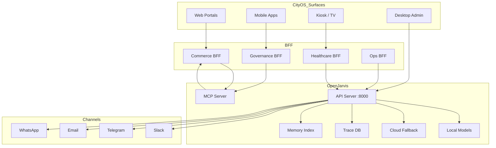

# OpenJarvis Full Inventory and Tech Stack

> [← Back to CityOS Integrations](../index.md)

This document catalogs every application, component, and technology in the OpenJarvis repository and maps how each can be utilized within the Dakkah CityOS ecosystem.

---

## 1. Executive Summary

OpenJarvis is a **local-first personal AI framework** with three deployment targets:
- **Python backend** — CLI, API server, agents, tools, channels
- **Rust extensions** — High-performance crates for core operations
- **Desktop app** — Tauri v2 + React 19 + Vite cross-platform GUI
- **Frontend** — React 19 SPA that powers both web and desktop

CityOS can consume OpenJarvis as an **internal AI service** across all 45 apps and ~120 domains.

---

## 2. Technology Stack

### 2.1 Core Backend

| Layer | Technology | Version | Purpose |
|---|---|---|---|
| Language | Python | 3.10–3.13 | Primary backend language |
| Build | Hatchling | — | PEP 517 build backend |
| Package manager | uv | — | Fast Python package management |
| CLI framework | Click | ≥8 | Command-line interface |
| HTTP client | httpx | ≥0.27 | Async HTTP for API calls |
| WebSocket | websockets | ≥15.0.1 | Real-time communication |
| Data validation | Pydantic | ≥2.0 | API models and config |
| Server | FastAPI + Uvicorn | ≥0.110 / ≥0.30 | API server (optional extra) |
| Async runtime | asyncio / tokio (Rust) | — | Concurrent execution |
| Database (traces) | SQLite / PostgreSQL | — | Trace and telemetry storage |
| Vector search | FAISS / ColBERT | optional | Memory index (optional extras) |
| Search | DuckDuckGo (ddgs) | ≥9.11.4 | Web search tool |

### 2.2 AI/ML Engine

| Component | Technology | Purpose |
|---|---|---|
| Model routing | OpenAI-compatible API | Unified interface for all models |
| Local inference | Ollama | Default local CPU/GPU inference |
| Apple Silicon | MLX (mlx-lm) | macOS local inference (optional) |
| GPU servers | vLLM | High-throughput GPU inference (optional) |
| Cloud fallback | OpenAI, Anthropic, Google GenAI | Cloud API fallback (optional) |
| Router | LiteLLM | Multi-provider routing (optional) |
| Multi-model | Multi-engine shim | Route to best available model |
| Apple FM | apple_fm_shim | Apple Foundation Models (macOS 15+) |
| Quantized | Gemma C++ (pygemma) | Lightweight quantized models |

### 2.3 Rust Extensions

| Crate | Purpose | CityOS Relevance |
|---|---|---|
| `openjarvis-core` | Core primitives, serialization | Foundation for all integrations |
| `openjarvis-engine` | Inference engine bridge | Model execution performance |
| `openjarvis-agents` | Agent runtime in Rust | Faster agent orchestration |
| `openjarvis-tools` | Tool dispatch | MCP tool execution |
| `openjarvis-learning` | Training loop, Pearl mining | Domain-specific model fine-tuning |
| `openjarvis-telemetry` | Metrics and traces | Observability integration |
| `openjarvis-traces` | Trace recording and replay | Audit and debugging |
| `openjarvis-security` | Crypto, signing, sandbox | Security-critical operations |
| `openjarvis-mcp` | MCP protocol implementation | Tool server/client |
| `openjarvis-python` | PyO3 bridge | Python ↔ Rust interop |
| `openjarvis-sessions` | Session management | Stateful conversations |
| `openjarvis-workflow` | Workflow engine | Temporal alternative |
| `openjarvis-skills` | Skill execution | Hermes/OpenClaw skill runtime |
| `openjarvis-recipes` | Reusable workflows | Pre-built CityOS workflows |
| `openjarvis-templates` | Prompt templates | Standardized prompts |
| `openjarvis-a2a` | Agent-to-Agent protocol | Multi-agent coordination |
| `openjarvis-scheduler` | Cron-like scheduling | Scheduled CityOS tasks |

### 2.4 Desktop & Frontend

| Layer | Technology | Version |
|---|---|---|
| Framework | Tauri v2 | — |
| Frontend | React | 19.0.0 |
| Bundler | Vite | 6.0.0 |
| Router | React Router | 7.13.1 |
| Styling | Tailwind CSS | 4.2.1 |
| UI primitives | shadcn/ui + Base UI | 4.0.7 / 1.3.0 |
| Animation | Motion (Framer Motion) | 12.38.0 |
| Charts | Recharts | 3.7.0 |
| State | Zustand | 5.0.11 |
| Markdown | react-markdown + remark/rehype | 10.1.0 |
| Math | KaTeX | 0.16.38 |
| Analytics | PostHog | 1.373.2 |
| PWA | vite-plugin-pwa | 1.2.0 |

### 2.5 Tauri Plugins (Desktop)

| Plugin | Purpose |
|---|---|
| `autostart` | Launch on system boot |
| `dialog` | Native file dialogs |
| `global-shortcut` | Keyboard shortcuts (e.g., Cmd+J) |
| `notification` | OS-native notifications |
| `process` | Process management |
| `shell` | Shell command execution |
| `updater` | Auto-update mechanism |

### 2.6 Deployment Targets

| Target | Config | Notes |
|---|---|---|
| Docker | `deploy/docker/Dockerfile` | Standard + GPU (NVIDIA/ROCM) + Sandbox |
| systemd | `deploy/systemd/openjarvis.service` | Linux daemon |
| launchd | `deploy/launchd/com.openjarvis.plist` | macOS daemon |
| Desktop | Tauri + NSIS/DMG/AppImage | Windows, macOS, Linux |
| Sandbox | `Dockerfile.sandbox` | WASM/isolated execution |

---

## 3. Application & Component Inventory

### 3.1 CLI Commands (`jarvis`)

OpenJarvis exposes 35+ CLI commands via `src/openjarvis/cli/`:

| Command | Purpose | CityOS Utilization |
|---|---|---|
| `jarvis ask` | Single-turn Q&A | Citizen/merchant support chat |
| `jarvis chat` | Interactive chat | Developer assistant, ops console |
| `jarvis init` | Initialize with presets | CityOS preset: `cityos-governance`, `cityos-commerce` |
| `jarvis serve` | Start API server | CityOS BFF integration endpoint |
| `jarvis agent` | Run specific agent | Orchestrator, monitor, research agents |
| `jarvis workflow` | Execute workflows | Temporal.io alternative for CityOS |
| `jarvis scheduler` | Cron-like scheduling | Replace `lib/scheduler.ts` in ops-helper-ui |
| `jarvis memory` | Index and search docs | Index CityOS policy PDFs, domain docs |
| `jarvis skill` | Install/manage skills | Hermes/OpenClaw skills for CityOS domains |
| `jarvis mine` | Pearl model mining | Fine-tune on CityOS trace data |
| `jarvis bench` | Benchmark models | Intelligence Per Watt for CityOS workloads |
| `jarvis eval` | Run evaluations | Test AI integration quality |
| `jarvis doctor` | Health check | CityOS deploy health verification |
| `jarvis digest` | Morning digest | CityOS officer daily briefing |
| `jarvis connect` | OAuth connectors | Gmail, GDrive, Slack for CityOS channels |
| `jarvis channels` | Channel management | Bridge CityOS Kuzzle to OpenJarvis channels |
| `jarvis config` | Configuration | Per-tenant CityOS config |
| `jarvis vault` | Secret management | Integrate with CityOS secret store |
| `jarvis telemetry` | Telemetry control | Feed into CityOS Prometheus/Grafana |
| `jarvis deep-research` | Multi-hop research | Policy analysis, city planning research |
| `jarvis operators` | Operator framework | Custom CityOS operators |
| `jarvis gateway` | Gateway management | BFF gateway alternative |

### 3.2 Built-in Agents (`src/openjarvis/agents/`)

| Agent | Mode | Purpose | CityOS Use Case |
|---|---|---|---|
| `simple` | On-demand | Single-turn chat | Quick citizen Q&A |
| `orchestrator` | On-demand | Multi-turn reasoning + tool selection | Complex service routing |
| `native_react` | On-demand | ReAct loop (Thought-Action-Observation) | Step-by-step problem solving |
| `native_openhands` | On-demand | CodeAct (Python code execution) | Developer assistant, automation |
| `deep_research` | On-demand | Multi-hop research with citations | Policy research, city planning |
| `morning_digest` | Scheduled | Daily briefing (email, calendar, news) | Officer morning briefing |
| `monitor_operative` | Continuous | Persistent monitoring with memory | Infrastructure monitoring |
| `operative` | Continuous | Autonomous agent with state | Long-running city service monitoring |
| `channel_agent` | Continuous | Channel-specific responder | Slack/Discord citizen support bot |
| `opencode` | On-demand | OpenCode coding agent | Developer code review |
| `claude_code` | On-demand | Claude Code runner | Advanced development tasks |
| `openhands` | On-demand | OpenHands SDK integration | Software engineering tasks |
| `rlm` | On-demand | Research Language Model | Academic/policy research |
| `hybrid` | Mixed | Local+cloud paradigm agents | Adaptive city services |

### 3.3 Hybrid Paradigm Agents (6 types)

| Paradigm | Description | CityOS Application |
|---|---|---|
| Advisors | Multiple specialist agents consult | Multi-department policy review |
| Conductor | Orchestrates sub-agents | Cross-domain service coordination |
| Minions | Delegates to worker agents | Parallel permit processing |
| Archon | Hierarchical command structure | Emergency response chain |
| SkillOrchestra | Skill-chaining | Complex citizen service workflows |
| ToolOrchestra | Tool-chaining | Multi-system data aggregation |

### 3.4 Channels (`src/openjarvis/channels/`)

| Channel | Protocol | CityOS Use Case |
|---|---|---|
| Slack | Slack SDK | Internal ops, citizen support bot |
| Discord | discord.py | Community engagement |
| Telegram | python-telegram-bot | Citizen alerts, bot services |
| Email (SMTP/IMAP) | Standard | Official communications |
| Gmail | Google API | Officer email integration |
| WhatsApp | Baileys / Official API | Citizen messaging (high reach) |
| iMessage | BlueBubbles / macOS daemon | Apple ecosystem users |
| Signal | signal-cli | Secure communications |
| Matrix | matrix-nio | Decentralized messaging |
| IRC | Standard | Developer community |
| XMPP | slixmpp | Legacy system integration |
| Line | line-bot-sdk | Asian market citizens |
| Viber | viberbot | European market citizens |
| Twilio SMS | Twilio API | SMS alerts for all citizens |
| Mastodon | Mastodon.py | Fediverse presence |
| Reddit | praw | Community engagement |
| Twitch | twitchio | Live streaming events |
| Nostr | pynostr | Decentralized social |
| Google Chat | Google API | Workspace integration |
| Feishu (Lark) | feishu API | Enterprise collaboration |
| Mattermost | mattermostdriver | Self-hosted team chat |
| Rocket.Chat | rocketchat-API | Open-source team chat |
| Zulip | zulip API | Threaded discussions |
| Microsoft Teams | Standard | Enterprise integration |
| Webhook | HTTP | Custom CityOS integrations |
| WebChat | WebSocket | Embedded citizen portal chat |

### 3.5 Tools (`src/openjarvis/tools/`)

| Tool | Capability | CityOS Application |
|---|---|---|
| `web_search` | DuckDuckGo search | Public information lookup |
| `browser` | Playwright web browsing | Form filling, data extraction |
| `browser_axtree` | Accessibility tree browsing | Screen-reader compatible automation |
| `shell_exec` | Local shell commands | **Restricted — ops only** |
| `docker_shell_exec` | Docker container commands | Safe sandboxed execution |
| `code_interpreter` | Python code execution | Analytics, data processing |
| `code_interpreter_docker` | Sandboxed Python execution | Secure citizen data analysis |
| `file_read` | Read local files | Document access |
| `file_write` | Write local files | Report generation |
| `git_tool` | Git operations | Developer workflows |
| `http_request` | HTTP API calls | External service integration |
| `db_query` | SQL database queries | **Restricted — read-only for CityOS** |
| `knowledge_search` | Semantic document search | CityOS policy lookup |
| `knowledge_sql` | SQL over knowledge base | Structured document queries |
| `retrieval` | RAG retrieval | Context-aware responses |
| `memory_manage` | Long-term memory | Cross-session citizen context |
| `skill_manage` | Install/use skills | Domain-specific capabilities |
| `channel_tools` | Send/receive messages | Multi-channel notifications |
| `text_to_speech` | TTS generation | Voice announcements |
| `audio_tool` | Audio processing | Voice memo transcription |
| `image_tool` | Image analysis | Inspector photo analysis |
| `pdf_tool` | PDF parsing | Document ingestion |
| `calculator` | Math evaluation | Quick calculations |
| `think` | Reasoning step | Transparent decision chains |
| `llm_tool` | Sub-LLM calls | Multi-model reasoning |
| `user_profile_manage` | Profile management | Citizen preference storage |
| `proactive_tools` | Trigger actions | Scheduled city notifications |
| `scan_chunks` | Chunked document scan | Large document processing |
| `apply_patch` | Code patch application | Automated fixes |
| `approval_store` | Human approval workflow | Critical action confirmation |
| `digest_collect` | Information aggregation | Daily city digest |
| `mcp_adapter` | MCP tool proxy | CityOS domain tools via MCP |
| `storage_tools` | File storage operations | MinIO integration |

### 3.6 Skills System (`src/openjarvis/skills/`)

| Component | Description | CityOS Application |
|---|---|---|
| Skill importer | Import from GitHub repos | CityOS custom skills repo |
| Skill executor | Run skills as tools | Domain-specific automation |
| Skill benchmark | Evaluate skill quality | CityOS skill certification |
| Hermes sync | ~150 skills from NousResearch | Research, coding, analysis |
| OpenClaw sync | ~13,700 community skills | Broad citizen service skills |
| agentskills.io | Open standard compliance | Interoperable skill ecosystem |
| Overlay system | Skill composition | Multi-skill city workflows |

### 3.7 Learning & Optimization (`src/openjarvis/learning/`)

| Component | Technology | CityOS Application |
|---|---|---|
| Learning orchestrator | dspy, gepa | Optimize prompts from CityOS traces |
| Agent training | Reinforcement learning | Improve citizen support quality |
| Spec search | LLM-guided | Find optimal model configs |
| Intelligence routing | Multi-model selection | Route to best model per query |
| Prompt optimization | DSPy | Better prompts for city domains |

### 3.8 Mining / Pearl (`src/openjarvis/mining/`)

| Component | Description | CityOS Application |
|---|---|---|
| CPU miner | Local CPU training | Small model fine-tuning |
| Apple MPS miner | Apple Silicon training | Mac-based dev environments |
| vLLM miner | GPU server training | Production model fine-tuning |
| Model converter | Pearl format conversion | CityOS-optimized models |
| Metrics collector | Training telemetry | Grafana dashboard integration |
| Discovery | Auto-detect mining configs | Dynamic hardware adaptation |

### 3.9 Evaluations (`src/openjarvis/evals/`)

| Component | Purpose | CityOS Application |
|---|---|---|
| Dataset curation | Build test sets | CityOS domain benchmarks |
| Execution harness | Run evals | CI-integrated quality gates |
| Scorers | Accuracy, relevance | Citizen satisfaction metrics |
| Backends | Local/cloud models | Multi-environment testing |
| Comparison | A/B testing | Model selection for production |
| Tracking | wandb, spreadsheets | Performance monitoring |

### 3.10 Frontend Pages (`frontend/src/pages/`)

| Page | Purpose | CityOS Reuse |
|---|---|---|
| `ChatPage` | Main chat interface | Embed in citizen/merchant portals |
| `DashboardPage` | Model usage, savings | Ops team AI cost dashboard |
| `AgentsPage` | Agent selection & config | CityOS agent management |
| `DataSourcesPage` | Memory/index management | CityOS document indexing UI |
| `SettingsPage` | Configuration | Per-tenant CityOS settings |
| `LogsPage` | Trace and log viewer | Audit log viewer for compliance |
| `GetStartedPage` | Onboarding | CityOS citizen onboarding flow |

### 3.11 Server API Endpoints (`src/openjarvis/server/`)

| Route File | Endpoints | CityOS Integration |
|---|---|---|
| `routes.py` | Core chat, completions | Primary BFF consumption |
| `api_routes.py` | OpenAI-compatible API | Direct API integration |
| `agent_manager_routes.py` | Agent CRUD | CityOS agent lifecycle |
| `research_router.py` | Deep research | Policy analysis backend |
| `digest_routes.py` | Morning digest | Officer briefing service |
| `connectors_router.py` | OAuth connectors | Gmail, Slack for CityOS |
| `approval_routes.py` | Human approval | Critical action confirmation |
| `analytics_routes.py` | Usage analytics | Prometheus metrics feed |
| `upload_router.py` | File uploads | Document ingestion |
| `webhook_routes.py` | Webhooks | CityOS event triggers |
| `ws_bridge.py` | WebSocket bridge | Real-time chat |
| `stream_bridge.py` | SSE streaming | CityOS portal streaming |
| `cloud_router.py` | Cloud model routing | Fallback management |
| `session_store.py` | Session persistence | Cross-session memory |
| `auth_middleware.py` | API key auth | Keycloak JWT integration point |

---

## 4. CityOS Utilization Matrix

### 4.1 By CityOS App

| CityOS App | OpenJarvis Components | Integration Pattern |
|---|---|---|
| `apps/ai-assistant/` | `serve`, `orchestrator`, `chat` | Primary AI surface |
| `apps/voice-assistant/` | `speech`, `text_to_speech`, `ask` | Voice-first interface |
| `apps/smart-city-portal/` | `chat`, `knowledge_search`, `web_search` | Citizen support |
| `apps/mobile/` | `chat`, `channels`, `memory` | Mobile citizen app |
| `apps/mobile-merchant/` | `chat`, `mcp_adapter` (commerce) | Merchant assistant |
| `apps/business-dashboard/` | `dashboard`, `analytics_routes` | Merchant analytics |
| `apps/mobile-government/` | `chat`, `deep_research` | Officer field assistant |
| `apps/city-dashboard/` | `monitor_operative`, `telemetry` | Command center |
| `apps/mobile-inspector/` | `image_tool`, `offline` | Field inspection |
| `apps/mobile-driver/` | `speech`, `proactive_tools` | Hands-free driver assistant |
| `apps/fleetops/` | `monitor_operative`, `channels` | Fleet monitoring |
| `apps/dev-portal/` | `native_openhands`, `code_interpreter` | Developer assistant |
| `apps/ops-helper-ui/` | `shell_exec`, `docker_shell_exec`, `scheduler` | Ops automation |
| `apps/kiosk/` | `chat`, `knowledge_search` | Public kiosk |
| `apps/storefront/` | `chat`, `recommendations` | E-commerce assistant |
| `apps/web-platform/` | `chat`, `orchestrator` | General web AI |
| `apps/storybook/` | `sdui-ai-blocks` | Block design testing |
| `apps/medusa-backend/` | `mcp_adapter` (commerce tools) | Backend AI tools |
| `apps/bff-gateway/` | `mcp_server`, `api_routes` | BFF AI gateway |
| `apps/mobile-pos/` | `chat`, `quick_select` | POS assistant |
| `apps/superapp/` | All components | All-in-one citizen AI |

### 4.2 By CityOS Domain

| CityOS Domain | OpenJarvis Tools/Agents | Use Case |
|---|---|---|
| `commerce` | `mcp_adapter`, Medusa tools | Merchant assistant, POS |
| `governance` | `deep_research`, `knowledge_search` | Policy Q&A, permit processing |
| `healthcare` | `knowledge_search` (non-PHI) | Facility directory, education |
| `transportation` | `proactive_tools`, `monitor_operative` | Traffic alerts, route optimization |
| `fleet-logistics` | `orchestrator`, `channels` | Fleet dispatch, driver comms |
| `public-safety` | `monitor_operative`, `approval_store` | Incident response |
| `security-services` | `bench`, `eval`, `analytics` | RBAC audit, compliance |
| `facilities` | `image_tool`, `offline` | Inspection, maintenance |
| `citizen-services` | `chat`, `web_search` | General support |
| `education` | `knowledge_search`, `deep_research` | Learning assistance |
| `iot-telemetry` | `monitor_operative`, `channels` | Device monitoring |
| `events-culture` | `channels`, `proactive_tools` | Event notifications |
| `parking-zones` | `proactive_tools` | Parking availability |
| `energy` | `monitor_operative` | Usage monitoring |
| `environment` | `monitor_operative`, `deep_research` | Environmental analysis |
| `ai-ml` | `mine`, `bench`, `eval` | Model development |
| `system-observability` | `telemetry`, `analytics` | System monitoring |
| `core-cms` | `mcp_adapter` (Payload tools) | Content management |

### 4.3 By CityOS Compose Project

| Compose Project | OpenJarvis Deployment | Services |
|---|---|---|
| `cityos-apps-backend` | OpenJarvis API server container | `serve`, `agents`, `workflows` |
| `cityos-bff` | MCP server containers | `mcp_adapter`, domain tools |
| `cityos-infra` | Redis/PostgreSQL for traces | `telemetry`, `session_store` |
| `cityos-helpers` | Ops-helper AI extensions | `scheduler`, `mine`, `bench` |
| `cityos-apps-surfaces` | Desktop app distribution | Tauri desktop for admin users |

---

## 5. Integration Architecture



---

## 6. Deployment Recommendations

### 6.1 Development
```bash
# Run OpenJarvis locally alongside CityOS
jarvis serve --port 8000
# Or with specific extras for CityOS
uv sync --extra inference-vllm --extra memory-faiss --extra scheduler --extra server
jarvis serve
```

### 6.2 Staging/Production
```yaml
# docker-compose.cityos.yml addition
services:
  openjarvis:
    image: openjarvis:latest
    ports:
      - "8000:8000"
    volumes:
      - openjarvis-data:/app/data
      - openjarvis-models:/app/models
    environment:
      - OPENJARVIS_API_KEY=${OPENJARVIS_API_KEY}
      - OLLAMA_HOST=ollama:11434
    networks:
      - cityos-bff
      - cityos-apps-backend
```

### 6.3 Desktop for Admins
```bash
# Build Tauri desktop for CityOS admin workstations
cd desktop
pnpm tauri build
# Distributes: .exe (Windows), .dmg (macOS), .AppImage (Linux)
```

---

## 7. Security Considerations

| OpenJarvis Feature | CityOS Security Control |
|---|---|
| `shell_exec` | **Disable in production** — use `docker_shell_exec` only |
| `code_interpreter` | Run in sandboxed Docker |
| `file_read` / `file_write` | Restrict to `/tmp` and CityOS-approved paths |
| `db_query` | Read-only, tenant-scoped views |
| Cloud fallback | Require explicit approval per request |
| Memory index | Encrypt at rest, tenant-segregated |
| Trace store | Immutable append-only logs |
| API keys | Rotate weekly, store in CityOS vault |

---

## 8. Performance Characteristics

| Workload | Local (Ollama) | vLLM GPU | Cloud Fallback |
|---|---|---|---|
| Single-turn chat | ~500ms | ~100ms | ~800ms |
| Multi-turn (orchestrator) | ~2s | ~500ms | ~3s |
| Deep research | ~30s | ~10s | ~45s |
| Code generation | ~5s | ~1s | ~6s |
| Image analysis | ~3s (CPU) | ~500ms (GPU) | ~2s |
| Tool call (MCP) | +200ms | +100ms | +300ms |

---

## See also

- [CityOS Integrations](../index.md) — Full documentation index
- [Integration Overview](../integration/overview.md) — High-level integration patterns
- [OpenJarvis Runtime Integration](../integration/openjarvis-runtime.md) — API connection details
- [MCP and Tool Integration](../integration/mcp-tools.md) — Tool catalog integration
- [System Context](../architecture/system-context.md) — Architecture and trust boundaries
- [OpenJarvis README](https://github.com/open-jarvis/OpenJarvis/blob/main/README.md) — Upstream project documentation
