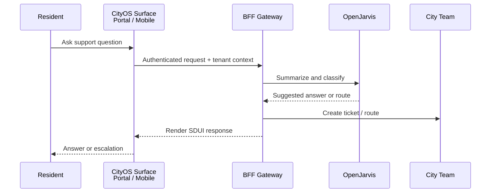

# Citizen Support Assistant

> [← Back to Use-Case Overview](overview.md) · [← CityOS Integrations](../index.md)

This use case covers assisting city residents with common support questions and routing requests to the correct CityOS workflow across the citizen portal (`apps/smart-city-portal/`) and citizen mobile app (`apps/mobile/`).

**Related**: [Use-Case Overview](overview.md) · [OpenJarvis Runtime Integration](../integration/openjarvis-runtime.md) · [MCP and Tool Integration](../integration/mcp-tools.md)



## Goal

Help users find the right service, answer approved policy questions, and route issues to the correct team or queue — all within their tenant boundary in the CityOS Node hierarchy (City → Zone → POI → Tenant).

## Inputs

- Free-text question (Arabic or English; CityOS supports Arabic content quality checks).
- Resident or case identifier, if authenticated via Keycloak OIDC.
- Service category (governance, commerce, healthcare, transportation, utilities).
- Location or jurisdiction (Node in the hierarchy), used to filter relevant services and policies.
- Device context (web portal, iOS, Android, kiosk) — responses may include SDUI blocks tailored to the surface.

## Required tools and systems

- **Policy/document search** — indexed from `packages/domains/governance/src/seed/` or Payload CMS collections.
- **Service directory lookup** — query governance or commerce domain APIs for available services.
- **Case/ticket lookup** — read-only check of existing requests (if authenticated).
- **Routing or ticket creation** — create a ticket in the appropriate CityOS workflow (Temporal.io or Payload CMS).
- **Notification or follow-up tool** — push notification via Kuzzle/Ably or email/SMS through OpenJarvis channels.

## Multi-tenancy and Node hierarchy

Every citizen interaction is scoped to a Node:

```
Global → Country → Region → City → Zone → POI → Tenant
```

- The BFF gateway extracts the tenant claim from the Keycloak JWT.
- All tool calls must include the Node ID so data is filtered correctly.
- OpenJarvis should never return data for a different Node than the authenticated resident's.
- If a resident moves between zones, their history follows them only if policy allows cross-Node data access.

## SDUI response blocks

Citizen support responses can be rendered as SDUI blocks for rich interaction:

- `TextBlock` — plain answer
- `LinkBlock` — link to a service or form
- `FormBlock` — collect additional details
- `MapBlock` — show nearest facility (using PostGIS)
- `StatusBlock` — show case status
- `ActionBlock` — schedule callback or appointment

## Compliance considerations

- Do not expose account details unless the requester is authenticated via Keycloak.
- Redact personal data in summaries unless it is required for the workflow and policy allows it.
- Log the decision to route, summarize, or escalate in the BFF audit trail.
- Require human review before any irreversible action (e.g., closing a case, issuing a refund).
- Run `pnpm audit:arabic-quality` to ensure Arabic responses meet content quality standards.

## Failure modes

- If the answer is uncertain, the assistant should say so and escalate to a human agent.
- If the resident cannot be verified, the assistant should fall back to general guidance and public information only.
- If a lookup fails, the assistant should not fabricate a case status or policy detail.
- If OpenJarvis is unavailable, return a static SDUI block with a "Service temporarily unavailable" message and a callback option.

---

## See also

- [Use-Case Overview](overview.md) — All CityOS use cases
- [Merchant Assistant](merchant-assistant.md) — Commerce-focused assistant
- [Government Officer Assistant](government-officer-assistant.md) — Internal government workflows
- [Mobile and Expo Integration](../integration/mobile-expo-integration.md) — Mobile surface integration
- [SDUI and AI Blocks](../integration/sdui-ai-blocks.md) — Block rendering for citizen responses
