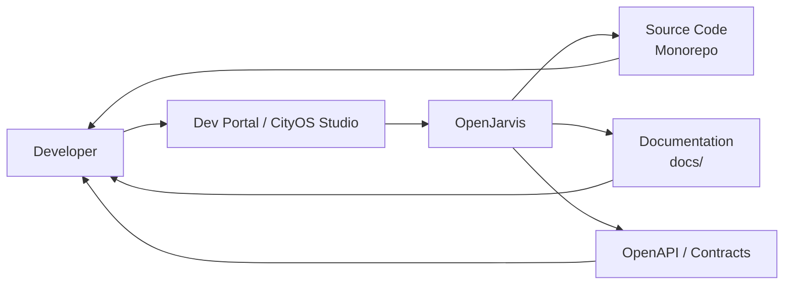

# Developer Assistant

> [← Back to Use-Case Overview](overview.md) · [← CityOS Integrations](../index.md)

This use case covers assisting CityOS developers using the developer portal (`apps/dev-portal/`), CityOS Studio (`packages/cityos-studio/`), and the AI/ML domain (`packages/domains/ai-ml/`). It helps with code generation, documentation search, SDUI block creation, and API contract understanding.

**Related**: [Use-Case Overview](overview.md) · [SDUI and AI Blocks](../integration/sdui-ai-blocks.md) · [Testing Strategy](../operations/testing-strategy.md)

## Goal

Accelerate CityOS development by providing AI-assisted code generation, documentation retrieval, block scaffolding, and debugging guidance — all grounded in the actual monorepo.

## Typical tasks

- **Code generation**: "Generate a Payload CMS collection for a new `waste-management` domain" → OpenJarvis produces TypeScript code following `DOMAIN_PACKAGE_ARCHITECTURE.md`.
- **Documentation search**: "How do I add a new SDUI block?" → OpenJarvis searches `docs/` and `AGENTS.md` for instructions.
- **API contract Q&A**: "What is the BFF commerce gateway response schema for order creation?" → OpenJarvis queries `packages/contracts/` or `openapi.yaml`.
- **Block scaffolding**: "Create a commerce product card block for mobile surfaces" → OpenJarvis generates the block definition + renderer stubs.
- **Debug assistance**: "Why is my domain import failing?" → OpenJarvis checks for cross-domain import violations (domains must not import siblings directly).
- **Testing help**: "Write a Vitest test for my new rollback API" → OpenJarvis generates test cases following existing patterns.

## Primary surfaces

| Surface | App | Notes |
|---|---|---|
| Developer portal | `apps/dev-portal/` | Next.js 15, technical docs, API explorer |
| CityOS Studio | `packages/cityos-studio/` | Dev tool for block design, token management |
| IDE / CLI | Local | Via OpenJarvis CLI or MCP server in editor |

## Required tools and systems

- **Monorepo source** — `packages/`, `src/`, `apps/` (read-only access for code search).
- **Documentation index** — `docs/`, `AGENTS.md`, `README.md`, `SKILL.md` files.
- **API contracts** — `packages/contracts/`, `packages/surface-contracts/`, `openapi.yaml`.
- **Design tokens** — `packages/design-tokens/`, `packages/design-system/`.
- **Block registry** — `packages/domains/*/src/blocks/`, `packages/blocks-core/`.

## MCP tool examples

| Tool | Domain | Risk | Notes |
|---|---|---|---|
| `search_docs` | ai-ml | read-only | Semantic search over docs/ |
| `generate_collection` | core-cms | approval-required | Scaffolds Payload collection |
| `generate_block` | blocks-core | approval-required | Scaffolds SDUI block + renderer |
| `query_api_contract` | contracts | read-only | OpenAPI schema lookup |
| `check_import_rules` | shared | read-only | Validates DDD boundary rules |

## Guardrails

- Generated code must follow CityOS conventions: strict TypeScript, no `any`, workspace aliases, under 500 lines per file.
- Never generate code that hardcodes secrets or environment variables.
- Block definitions must pass `pnpm design:audit:blocks` before registration.
- Generated collections require `pnpm generate:types` to update `src/payload-types.ts`.
- All generated code should include a header comment: `// Generated by OpenJarvis — review before commit`.

## Failure modes

- If the requested pattern is not in the codebase, suggest the closest existing example and flag for architecture review.
- If generated code violates DDD boundaries (cross-domain import), reject and explain the rule.
- If the OpenAPI spec is out of sync with implementation, warn the developer and suggest regeneration.
- If OpenJarvis generates code >500 lines, suggest splitting into co-located modules.

---

## See also

- [Use-Case Overview](overview.md) — All CityOS use cases
- [SDUI and AI Blocks](../integration/sdui-ai-blocks.md) — Block generation and validation
- [Testing Strategy](../operations/testing-strategy.md) — Testing AI-generated code
- [MCP and Tool Integration](../integration/mcp-tools.md) — Tool patterns for developer tools
- [Integration Overview](../integration/overview.md) — High-level integration surfaces
