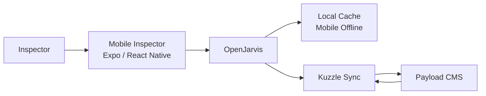

# Field Inspector Assistant

> [← Back to Use-Case Overview](overview.md) · [← CityOS Integrations](../index.md)

This use case covers assisting field inspectors using the mobile inspector app (`apps/mobile-inspector/`), backed by the `facilities`, `public-safety`, and `governance` domains. Inspectors work offline-capable mobile devices in the field with intermittent connectivity.

**Related**: [Use-Case Overview](overview.md) · [Mobile and Expo Integration](../integration/mobile-expo-integration.md) · [Event-Driven Patterns](../integration/event-driven-patterns.md)

## Goal

Help inspectors prepare for inspections, generate checklists, record findings, upload media, and file reports — even with intermittent connectivity.

## Typical tasks

- **Inspection prep**: "What are the requirements for a restaurant health inspection?" → OpenJarvis retrieves checklist templates from the `facilities` domain.
- **Checklist generation**: "Generate a fire-safety checklist for a 3-story commercial building" → OpenJarvis creates a domain-specific checklist.
- **Photo upload and analysis**: Inspector uploads photos; OpenJarvis can describe defects or flag issues (if vision model is available locally).
- **Violation reporting**: "File a critical violation for blocked fire exits" → OpenJarvis drafts the report with severity classification.
- **Report completion**: "Summarize today's 5 inspections" → OpenJarvis compiles findings into a structured report.

## Primary surfaces

| Surface | App | Notes |
|---|---|---|
| Mobile inspector | `apps/mobile-inspector/` | Expo SDK 55, offline-capable, camera access |

## Offline-first architecture

Field inspectors may lose connectivity. The integration must:
- Cache inspection templates and checklists locally via `packages/mobile-offline/`.
- Queue photo uploads and form submissions for sync when connectivity returns.
- Store OpenJarvis responses in the offline cache for reference.
- Sync via Kuzzle (port 7512) when back online.

## Required tools and systems

- **Facilities domain** — inspection templates, checklists, building records.
- **Public-safety domain** — violation codes, severity levels, enforcement actions.
- **Governance domain** — permit history, compliance status.
- **Mobile offline sync** — `packages/mobile-offline/` for queue and sync.
- **Media storage** — MinIO (port 9001) for photo and video storage.

## MCP tool examples

| Tool | Domain | Risk | Notes |
|---|---|---|---|
| `get_inspection_template` | facilities | read-only | Building type + jurisdiction |
| `lookup_violation_code` | public-safety | read-only | Code ID or description search |
| `file_inspection_report` | facilities | approval-required | Creates official record |
| `upload_photo` | facilities | low-risk | MinIO bucket with metadata |
| `check_compliance_history` | governance | read-only | Past inspections by property |

## Data considerations

- Photos may contain PII (faces, license plates) — apply redaction before indexing.
- Inspection reports are official records — immutable once filed.
- GPS coordinates from mobile devices should be stored with consent and policy approval.
- All field data syncs to Payload CMS collections with audit trail.

## Failure modes

- If offline, cache the request and notify the inspector of sync status.
- If a template is missing for a building type, provide a generic fallback and flag for domain team review.
- If photo upload fails, retain local copy and retry with exponential backoff.
- If OpenJarvis is unavailable offline, fall back to pre-cached templates and static checklists.

---

## See also

- [Use-Case Overview](overview.md) — All CityOS use cases
- [Government Officer Assistant](government-officer-assistant.md) — Government workflows
- [Fleet Driver Assistant](fleet-driver-assistant.md) — Mobile logistics use case
- [Mobile and Expo Integration](../integration/mobile-expo-integration.md) — Offline sync and native modules
- [Event-Driven Patterns](../integration/event-driven-patterns.md) — Kuzzle sync and background jobs
