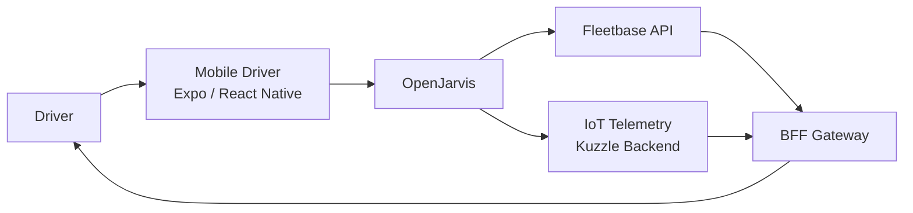

# Fleet Driver Assistant

> [← Back to Use-Case Overview](overview.md) · [← CityOS Integrations](../index.md)

This use case covers assisting fleet drivers and logistics operators using the mobile driver app (`apps/mobile-driver/`), driver companion (`apps/driver-app/`), and fleet operations UI (`apps/fleetops/`). It is backed by the `fleet-logistics`, `transportation`, and `iot-telemetry` domains, with Fleetbase (`apps/fleetbase/`) as the logistics engine.

**Related**: [Use-Case Overview](overview.md) · [Mobile and Expo Integration](../integration/mobile-expo-integration.md) · [Event-Driven Patterns](../integration/event-driven-patterns.md)

## Goal

Help drivers with route guidance, delivery status updates, vehicle telemetry alerts, incident reporting, and logistics coordination — optimized for hands-free or minimal-interaction use.

## Typical tasks

- **Route optimization**: "What's the best route to my next 3 deliveries?" → OpenJarvis queries Fleetbase routing with traffic data.
- **Delivery status**: "Mark delivery #4821 as completed with signature" → OpenJarvis triggers the Fleetbase status update API.
- **Vehicle telemetry**: "Why is the engine temperature warning on?" → OpenJarvis queries IoT telemetry from `apps/kuzzle-iot-backend/`.
- **Incident reporting**: "Report a traffic accident on Route 66" → OpenJarvis drafts an incident report with location and severity.
- **Load information**: "What is the cargo weight limit for this vehicle?" → OpenJarvis retrieves vehicle specs from Fleetbase.

## Primary surfaces

| Surface | App | Notes |
|---|---|---|
| Mobile driver | `apps/mobile-driver/` | Expo, GPS, push notifications |
| Driver companion | `apps/driver-app/` | Lightweight, minimal UI |
| Fleet operations | `apps/fleetops/` | Next.js, dispatch dashboard |

## Voice-first design

Drivers should interact hands-free:
- Voice input via faster-whisper (OpenJarvis `speech` extra).
- Text-to-speech responses for route instructions and alerts.
- Large touch targets when visual interaction is required.
- Minimal typing — use structured voice commands.

## Required tools and systems

- **Fleetbase API** — routes, deliveries, vehicles, drivers, waypoints (`apps/fleetbase/api/`).
- **Kuzzle IoT backend** — real-time telemetry ingestion (`apps/kuzzle-iot-backend/`).
- **Transportation domain** — traffic conditions, road closures, transit schedules.
- **GIS domain** — PostGIS routing, map tiles, geofencing (`packages/domains/gis-maps/`).

## MCP tool examples

| Tool | Domain | Risk | Notes |
|---|---|---|---|
| `get_route` | fleet-logistics | read-only | Waypoints + traffic |
| `update_delivery_status` | fleet-logistics | low-risk | Status + timestamp |
| `get_vehicle_telemetry` | iot-telemetry | read-only | Engine, temperature, fuel |
| `report_incident` | public-safety | approval-required | Creates official record |
| `check_traffic` | transportation | read-only | Real-time conditions |

## Safety and compliance

- Do not distract the driver — responses must be concise and actionable.
- Route changes should be confirmed verbally before applying.
- Incident reports must capture GPS, timestamp, and driver ID automatically.
- Vehicle telemetry alerts (e.g., overheating) should escalate to fleet ops immediately.
- All driving-time data is subject to labor regulations — retain and audit accordingly.

## Failure modes

- If GPS is unavailable, use last known position and warn the driver.
- If Fleetbase API is unreachable, queue status updates for retry.
- If IoT telemetry is stale, warn the driver and suggest a manual check.
- If voice recognition fails, provide a quick-select menu for common commands.

---

## See also

- [Use-Case Overview](overview.md) — All CityOS use cases
- [Field Inspector Assistant](field-inspector-assistant.md) — Offline mobile workflows
- [Internal Operations Assistant](ops-assistant.md) — Fleet ops dashboard
- [Mobile and Expo Integration](../integration/mobile-expo-integration.md) — Voice input and push notifications
- [Event-Driven Patterns](../integration/event-driven-patterns.md) — IoT telemetry and real-time alerts
