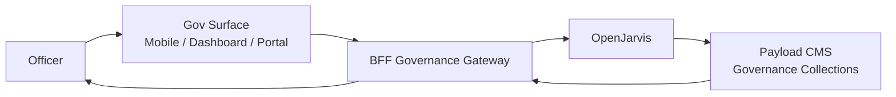

# Government Officer Assistant

> [← Back to Use-Case Overview](overview.md) · [← CityOS Integrations](../index.md)

This use case covers assisting government officers and city administrators using the mobile government app (`apps/mobile-government/`), city dashboard (`apps/city-dashboard/`), and government portal routes (`src/app/(government)/`). It is backed by the `governance`, `citizen-services`, and `public-safety` domains.

**Related**: [Use-Case Overview](overview.md) · [MCP and Tool Integration](../integration/mcp-tools.md) · [Authorization and Audit](../compliance/authorization-audit.md)

## Goal

Help government officers process permits, lookup policies, manage citizen cases, and access public records — with strict RBAC and audit requirements.

## Typical tasks

- **Permit processing**: "What documents are missing for permit APP-2025-0042?" → OpenJarvis queries the governance collection.
- **Policy Q&A**: "What is the zoning policy for commercial buildings in Zone 7?" → OpenJarvis searches indexed policy documents.
- **Citizen case management**: "Show me all open cases assigned to Officer Ahmad" → OpenJarvis filters cases by assignee and status.
- **Public records lookup**: "How many business licenses were issued last month?" → OpenJarvis queries aggregated registry data.
- **Report drafting**: "Draft a summary of traffic violations in Q2" → OpenJarvis compiles data from the `transportation` and `public-safety` domains.

## Primary surfaces

| Surface | App | Notes |
|---|---|---|
| City dashboard | `apps/city-dashboard/` | Command-center dark theme, forced dark mode |
| Mobile government | `apps/mobile-government/` | Expo, field officer companion |
| Government portal | `src/app/(government)/` | Next.js 15, Payload CMS-backed |

## Required tools and systems

- **Payload CMS governance collections** — permits, licenses, cases, policies, public records.
- **Governance domain blocks** — SDUI blocks for case timelines, permit status, policy excerpts.
- **Registry domain** — business licenses, property records, entity lookups.
- **Public-safety domain** — incident reports, violation records (read-only for most officers).

## MCP tool examples

| Tool | Domain | Risk | Notes |
|---|---|---|---|
| `get_permit_status` | governance | read-only | Permit ID + officer jurisdiction |
| `search_policies` | governance | read-only | Full-text search with tenant filter |
| `list_cases` | governance | read-only | Filter by assignee, status, zone |
| `update_case_status` | governance | approval-required | Case lifecycle changes |
| `issue_license` | governance | privileged | Requires supervisor approval + audit |

## RBAC and jurisdiction

Government officers have granular permissions based on:
- **Department** (zoning, health, transportation, public safety)
- **Jurisdiction** (city, zone, POI) from the Node hierarchy
- **Clearance level** (standard, supervisor, administrator)

OpenJarvis must respect these boundaries:
- A zone officer cannot access cases outside their zone.
- A standard officer cannot issue licenses or close high-priority cases.
- All privileged actions require supervisor confirmation.

## Compliance considerations

- Public records are subject to open-data policies and retention laws.
- Case data may contain citizen PII — redact unless the officer has explicit access.
- Permit and license decisions must be auditable and appealable.
- All queries and actions are logged to the BFF governance audit trail with officer identity and timestamp.
- Walt.id verifiable credentials can be used to authenticate citizen identity for permit applications.

## Failure modes

- If a policy document is not found, suggest contacting the policy office rather than fabricating an answer.
- If a case is outside the officer's jurisdiction, explain the boundary and suggest escalation.
- If a privileged action is attempted without authorization, deny immediately and alert the supervisor.

---

## See also

- [Use-Case Overview](overview.md) — All CityOS use cases
- [Citizen Support Assistant](citizen-support.md) — Citizen-facing services
- [Field Inspector Assistant](field-inspector-assistant.md) — Field inspection workflows
- [Security and Compliance Assistant](security-compliance-assistant.md) — RBAC audit and security ops
- [Authorization and Audit](../compliance/authorization-audit.md) — Permission model and audit requirements
