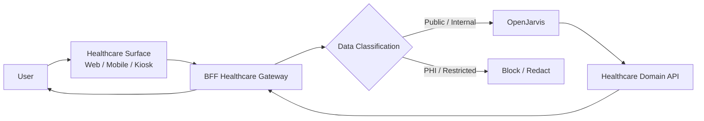

# Healthcare Assistant

> [← Back to Use-Case Overview](overview.md) · [← CityOS Integrations](../index.md)

This use case covers assisting healthcare staff, patients, and administrators using the healthcare domain (`packages/domains/healthcare/`), telemedicine (`packages/domains/telemedicine/`), and health-human-services (`packages/domains/health-human-services/`). **This use case explicitly excludes PHI (Protected Health Information) from OpenJarvis processing unless formally approved by compliance and legal review.**

**Related**: [Use-Case Overview](overview.md) · [Data Handling](../compliance/data-handling.md) · [Compliance Overview](../compliance/overview.md)



## Goal

Help users find healthcare facilities, schedule appointments, understand health policies, and navigate health services — without exposing PHI to OpenJarvis.

## Typical tasks (approved)

- **Facility directory**: "Find the nearest pediatric clinic open now" → OpenJarvis queries the `healthcare` domain directory.
- **Appointment scheduling**: "Book a general checkup for next Tuesday" → OpenJarvis guides the user through available slots.
- **Health policy Q&A**: "What vaccines are required for school enrollment?" → OpenJarvis searches public health policy documents.
- **Service eligibility**: "Am I eligible for the senior care program?" → OpenJarvis checks eligibility rules (non-PHI criteria).
- **Health education**: "Explain the symptoms of heat stroke" → OpenJarvis retrieves approved health education content.

## Excluded tasks (PHI-restricted)

The following must **never** be sent to OpenJarvis without explicit compliance approval:

- Patient medical records, diagnoses, prescriptions.
- Lab results, imaging reports, clinical notes.
- Insurance claim details with patient identifiers.
- Any data subject to HIPAA, GDPR health provisions, or local health privacy laws.

## Primary surfaces

| Surface | Domain | Notes |
|---|---|---|
| Citizen portal | `src/app/(citizen)/` | General public health info |
| Mobile app | `apps/mobile/` | Citizen health services |
| Kiosk | `apps/kiosk/` | Hospital/clinic check-in |
| Telemedicine portal | `packages/domains/telemedicine/` | Provider-facing |

## Data classification gate

The BFF healthcare gateway **must** implement a PHI filter before any data reaches OpenJarvis:

```
User Request → BFF Gateway → PHI Detector → [If PHI] → Block + Escalate
                                          → [If Safe]  → OpenJarvis
```

Use `src/openjarvis/analytics/redaction.py` patterns as a reference for automated redaction.

## MCP tool examples (safe)

| Tool | Domain | Risk | Notes |
|---|---|---|---|
| `find_facility` | healthcare | read-only | Public directory, no patient data |
| `get_available_slots` | healthcare | read-only | Schedule availability |
| `search_health_policies` | health-human-services | read-only | Public documents |
| `check_eligibility` | health-human-services | read-only | Rules-based, non-PHI |
| `book_appointment` | healthcare | approval-required | Creates appointment record |

## Compliance considerations

- All healthcare domain integrations require legal and compliance sign-off before production.
- PHI must be processed only within CityOS boundaries (PostgreSQL, Payload CMS) with appropriate access controls.
- OpenJarvis traces must not contain redacted PHI — verify with `pnpm audit:security`.
- Audit logs must record every healthcare API call, including the PHI filter decision.
- If in doubt, block the request and escalate to a human healthcare professional.

## Failure modes

- If PHI is detected in a request, block immediately and return: "This request contains protected health information and cannot be processed automatically. Please contact your healthcare provider."
- If a facility lookup fails, provide a generic fallback list and a phone number.
- If appointment booking conflicts with existing schedules, explain the conflict and suggest alternatives.
- If OpenJarvis is unavailable, route to a human operator or provide static health education content.

---

## See also

- [Use-Case Overview](overview.md) — All CityOS use cases
- [Data Handling](../compliance/data-handling.md) — Data classification and redaction
- [Compliance Overview](../compliance/overview.md) — PHI handling and compliance topics
- [Authorization and Audit](../compliance/authorization-audit.md) — Permission tiers for healthcare
- [Citizen Support Assistant](citizen-support.md) — General citizen-facing support
