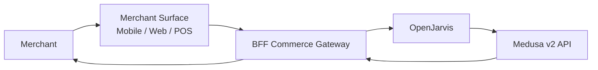

# Merchant Assistant

> [← Back to Use-Case Overview](overview.md) · [← CityOS Integrations](../index.md)

This use case covers assisting merchants and business owners using the merchant mobile app (`apps/mobile-merchant/`), merchant web portal (`apps/merchant-app/`), business dashboard (`apps/business-dashboard/`), and POS terminal (`apps/mobile-pos/`). It is backed by the `commerce` domain and Medusa v2 backend.

**Related**: [Use-Case Overview](overview.md) · [MCP and Tool Integration](../integration/mcp-tools.md) · [OpenJarvis Runtime Integration](../integration/openjarvis-runtime.md)

## Goal

Help merchants manage their product catalog, track orders, answer customer inquiries, and operate the POS — all through natural language or voice input.

## Typical tasks

- **Product catalog Q&A**: "What products are low in stock?" → OpenJarvis queries Medusa inventory via MCP and returns a summary.
- **Order management**: "Show me pending orders from today" → OpenJarvis filters orders by status and date.
- **POS assistance**: "How do I apply a discount code?" → OpenJarvis retrieves POS workflow documentation.
- **Sales analytics**: "Compare this week's sales to last week" → OpenJarvis queries commerce analytics (read-only).
- **Customer inquiry drafting**: "Draft a response to a refund request" → OpenJarvis generates text from approved policy.

## Primary surfaces

| Surface | App | Notes |
|---|---|---|
| Mobile merchant | `apps/mobile-merchant/` | Expo SDK 55, React Native 0.83.6 |
| Business dashboard | `apps/business-dashboard/` | Next.js 15, Tailwind CSS 4 |
| Merchant web portal | `apps/merchant-app/` | Next.js 15 |
| POS terminal | `apps/mobile-pos/` | Expo, payment native modules |

## Required tools and systems

- **Medusa v2 API** — orders, products, inventory, customers, promotions (`apps/medusa-backend/`).
- **Commerce domain blocks** — SDUI blocks for product cards, order tables, analytics charts (`packages/domains/commerce/src/blocks/`).
- **Policy search** — merchant terms, refund policy, shipping rules from Payload CMS collections.
- **Notification channels** — push via Kuzzle/Ably, email, or SMS for order alerts.

## MCP tool examples

| Tool | Domain | Risk | Notes |
|---|---|---|---|
| `list_products` | commerce | read-only | Filter by merchant/tenant |
| `get_order_status` | commerce | read-only | Order ID + tenant validation |
| `check_inventory` | commerce | read-only | Low-stock alerts |
| `apply_promotion` | commerce | approval-required | Affects pricing — needs confirmation |
| `generate_report` | commerce | read-only | Aggregate sales data |

## Multi-tenancy

Each merchant operates within a Tenant Node. All commerce MCP tools must:
- Validate the merchant's tenant ID from the Keycloak JWT.
- Filter Medusa queries by `store_id` or tenant scope.
- Never return data from competing merchants.

## Compliance considerations

- Do not expose customer PII (names, addresses, phone numbers) in summaries unless the merchant is authenticated and authorized.
- Payment card data must never pass through OpenJarvis — it stays in the PCI-scoped Medusa/POS flow.
- Refund and promotion mutations require explicit confirmation and audit logging.
- All actions are logged to the BFF commerce gateway audit trail.

## Failure modes

- If Medusa is unreachable, return a cached summary or queue the request for retry.
- If inventory data is stale, warn the merchant and suggest refreshing.
- If a promotion application fails, explain why (e.g., expired code, minimum order not met) without exposing internal error details.

---

## See also

- [Use-Case Overview](overview.md) — All CityOS use cases
- [Citizen Support Assistant](citizen-support.md) — Citizen-facing support
- [Government Officer Assistant](government-officer-assistant.md) — Government workflows
- [MCP and Tool Integration](../integration/mcp-tools.md) — Commerce tool catalog
- [SDUI and AI Blocks](../integration/sdui-ai-blocks.md) — Product card and order block rendering
