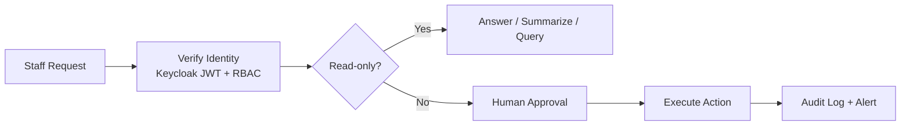

# Internal Operations Assistant

> [← Back to Use-Case Overview](overview.md) · [← CityOS Integrations](../index.md)

This use case covers assistant workflows for internal CityOS staff — especially platform operators, DevOps, and system administrators who manage the 5 Docker Compose projects, 45 apps, and ~120 domain packages.

**Related**: [Use-Case Overview](overview.md) · [Operations Overview](../operations/overview.md) · [Runbook](../operations/runbook.md)

## Typical tasks

- Summarize container health across the 5 compose projects (`cityos-infra`, `cityos-apps-backend`, `cityos-apps-surfaces`, `cityos-bff`, `cityos-helpers`).
- Draft deployment status reports from the deploy agent (port 9999) and GitHub Actions workflow history.
- Look up rollback snapshots in `/opt/dakkah-cityos-platform/rollbacks/` and explain what changed.
- Explain alert history from the ops-helper-ui alert store (unacknowledged critical/warning alerts).
- Query VPS metrics (memory, disk, load) from the ops-helper-ui history API with time range selection.
- Trigger low-risk follow-up actions: restart a service, pull a Docker image, or run an ops-helper command — **only with approval**.

## Integration with ops-helper-ui

The CityOS ops-helper-ui (`apps/ops-helper-ui/`) is a Next.js dashboard that already provides:

- Real-time Docker event streaming via SSE (`/api/docker/events`).
- Job output streaming (`/api/jobs/[id]/stream`) with shared stream buffers.
- Alert engine detecting container health changes and job failures.
- Rollback list and restore APIs (`/api/rollback/*`).
- Per-service compose actions (start/stop/restart/pull) for each project.
- Image pull with validation and scheduler for recurring operations.
- VPS history charts (pure SVG line charts) with 1h/6h/24h/7d ranges.

OpenJarvis can augment this by:

- **Natural language queries**: "Show me all critical alerts from the last 24 hours" → OpenJarvis queries the alert API and summarizes.
- **Runbook assistance**: "What do I do when the Medusa container is unhealthy?" → OpenJarvis retrieves the runbook and guides the operator.
- **Deployment summarization**: "Summarize the last deployment" → OpenJarvis reads GitHub workflow runs and deploy logs.
- **Approved actions**: "Restart the commerce BFF service" → OpenJarvis calls the MCP tool, which validates RBAC and triggers the compose action API.

## Required controls

- Staff identity must be verified via Keycloak JWT.
- Access should follow least privilege. Only ops-team RBAC roles can view container data or trigger actions.
- Sensitive operations (restart, restore rollback, image pull) should require explicit confirmation.
- All tool actions should be logged to the BFF audit trail and the ops-helper-ui job store (`/opt/dakkah-cityos-platform/ops-helper-ui/jobs.jsonl`).
- Alert on any failed action via the alert engine (`lib/alerts/engine.ts`).

## Suggested tool pattern

- Use read-only tools by default: container list, job history, alert list, metrics query.
- Require explicit confirmation before mutations: a two-step MCP pattern where OpenJarvis asks "Are you sure?" and the staff member confirms.
- Keep a human in the loop for any action that affects citizens, records, or service levels.
- Timebox all exec-based operations with operation locks (in-memory Map; use Redis for multi-instance).

## Validation checklist

- Does the staff role have RBAC access to the requested data?
- Can the result be traced to a source (job ID, trace ID, container ID)?
- Is the output limited to approved operational data (no secrets, no citizen PII)?
- Does the workflow recover safely if a tool fails (SDUI error block, alert generation)?

---

## See also

- [Use-Case Overview](overview.md) — All CityOS use cases
- [Operations Overview](../operations/overview.md) — Monitoring and routine checks
- [Runbook](../operations/runbook.md) — Incident response procedures
- [Security and Compliance Assistant](security-compliance-assistant.md) — Security audit use case
- [Fleet Driver Assistant](fleet-driver-assistant.md) — Logistics operations
- Are all exec routes writing to the shared stream buffer for real-time SSE visibility?
