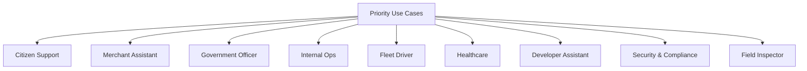

# Use-Case Overview

> [← Back to CityOS Integrations](../index.md)

Document use cases by operational value and risk, not just by feature area. CityOS has 45 apps and ~120 domain packages — prioritize use cases that serve the most users or handle the most sensitive operations.

**Related**: [Citizen Support](citizen-support.md) · [Merchant Assistant](merchant-assistant.md) · [Government Officer](government-officer-assistant.md) · [Security and Compliance](security-compliance-assistant.md)

## Use case index

| # | Use Case | Primary Domains | Primary Surfaces | Risk Level | Status |
|---|---|---|---|---|---|
| 1 | [Citizen Support](citizen-support.md) | citizen-services, governance, smart-city | smart-city-portal, mobile | Medium | Documented |
| 2 | [Merchant Assistant](merchant-assistant.md) | commerce, finance | mobile-merchant, business-dashboard, mobile-pos | Medium | Documented |
| 3 | [Government Officer](government-officer-assistant.md) | governance, citizen-services, public-safety | city-dashboard, mobile-government | High | Documented |
| 4 | [Internal Operations](ops-assistant.md) | system-observability, fleet-logistics | ops-helper-ui | Medium | Documented |
| 5 | [Fleet Driver](fleet-driver-assistant.md) | fleet-logistics, transportation, iot-telemetry | mobile-driver, fleetops | Medium | Documented |
| 6 | [Healthcare](healthcare-assistant.md) | healthcare, telemedicine, health-human-services | mobile, kiosk, citizen portal | **Critical** | Documented |
| 7 | [Developer Assistant](developer-assistant.md) | ai-ml, core-cms, blocks-core | dev-portal, cityos-studio | Low | Documented |
| 8 | [Security & Compliance](security-compliance-assistant.md) | security-services, public-safety, identity-auth | ops-helper-ui, city-dashboard | High | Documented |
| 9 | [Field Inspector](field-inspector-assistant.md) | facilities, public-safety, governance | mobile-inspector | Medium | Documented |

## Risk level definitions

- **Low** — Read-only operations, public data, minimal compliance exposure.
- **Medium** — Mixed read/write, internal data, requires RBAC and audit logging.
- **High** — Privileged actions, citizen-facing mutations, requires human approval.
- **Critical** — Regulated data (PHI, financial, legal), requires compliance sign-off before production.

## Use-case template

Every use-case document should include:

- Purpose
- User persona
- Preconditions
- Data sources
- Tools required
- Permissions required
- Failure modes
- Audit and compliance notes
- Human escalation path

## What to avoid

- Vague use cases without an owner domain.
- Read/write actions without authorization details.
- Workflows that rely on hidden prompts or undocumented data sources.
- Scenarios that do not state what happens when the model is wrong.
- Healthcare use cases that process PHI without explicit compliance approval.

---

## See also

- [CityOS Integrations](../index.md) — Full documentation index
- [Integration Overview](../integration/overview.md) — Integration surfaces for use cases
- [MCP and Tool Integration](../integration/mcp-tools.md) — Tool catalog by domain
- [Compliance Overview](../compliance/overview.md) — Risk levels and compliance requirements
