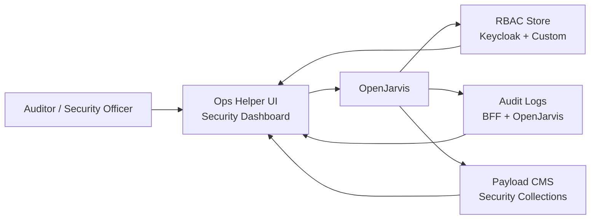

# Security and Compliance Assistant

> [← Back to Use-Case Overview](overview.md) · [← CityOS Integrations](../index.md)

This use case covers assisting security officers, compliance auditors, and platform administrators using the security-services domain (`packages/domains/security-services/`), public-safety domain (`packages/domains/public-safety/`), and the ops-helper-ui dashboard (`apps/ops-helper-ui/`).

**Related**: [Use-Case Overview](overview.md) · [Authorization and Audit](../compliance/authorization-audit.md) · [System Context](../architecture/system-context.md)

## Goal

Automate security monitoring, RBAC auditing, compliance checks, and incident response guidance — with full audit trails and human escalation for high-risk findings.

## Typical tasks

- **RBAC audit**: "List all users with administrator privileges in the commerce domain" → OpenJarvis queries Keycloak + custom RBAC.
- **Anomaly detection**: "Show me failed login attempts in the last 24 hours" → OpenJarvis queries BFF audit logs and Prometheus metrics.
- **Policy compliance check**: "Are all BFF routes using the `withBff()` wrapper?" → OpenJarvis runs `pnpm audit:api-routes` and summarizes findings.
- **Secret exposure scan**: "Has any API key appeared in logs this week?" → OpenJarvis queries Loki with regex patterns.
- **Incident response guidance**: "What is the runbook for a container escape incident?" → OpenJarvis retrieves the ops runbook and guides step-by-step.
- **Access review**: "Which users haven't logged in for 90 days?" → OpenJarvis queries Keycloak and suggests deactivation.

## Primary surfaces

| Surface | App | Notes |
|---|---|---|
| Ops helper UI | `apps/ops-helper-ui/` | Next.js 16, security alerts, audit views |
| City dashboard | `apps/city-dashboard/` | Command-center view for security ops |
| Security dashboard | `packages/domains/security-services/` | Domain-specific security metrics |

## Required tools and systems

- **Keycloak** — user identities, roles, sessions, login events (port 8080).
- **Custom RBAC store** — `docs/RBAC_AND_ROLES_SPECIFICATION.md`, `rbacChecker.ts`.
- **Audit logs** — BFF gateway logs, OpenJarvis traces, ops-helper-ui job logs.
- **Prometheus / Loki** — metrics and log aggregation for anomaly detection.
- **Payload CMS security collections** — incidents, access reviews, policy documents.
- **Ops-helper commands** — `audit:security`, `audit:api-routes`, `audit:collections`.

## MCP tool examples

| Tool | Domain | Risk | Notes |
|---|---|---|---|
| `query_rbac_roles` | identity-auth | read-only | Keycloak + custom RBAC |
| `search_audit_logs` | system-observability | read-only | BFF + OpenJarvis traces |
| `run_security_audit` | security-services | approval-required | Triggers `pnpm audit:security` |
| `check_secret_exposure` | security-services | read-only | Loki log regex scan |
| `get_incident_runbook` | public-safety | read-only | Retrieves response procedure |

## Compliance and governance

- Security assistants must never modify RBAC or delete accounts without human approval.
- Audit queries should be read-only by default. Mutation tools require elevated clearance.
- All security tool calls must be logged to an immutable audit store.
- Findings that indicate a breach or compliance violation must alert the security team immediately (via Alertmanager or ops-helper-ui critical alerts).
- Access to security audit data is itself subject to RBAC — only security officers and compliance auditors may query it.

## Failure modes

- If an anomaly is detected but cannot be explained, escalate to a human analyst immediately.
- If audit logs are incomplete, warn the user and suggest checking log retention settings in Loki.
- If a security scan finds a critical issue, trigger an alert and pause non-essential operations until reviewed.
- If OpenJarvis hallucinates a security finding, require corroboration from a second tool or human reviewer before acting.

---

## See also

- [Use-Case Overview](overview.md) — All CityOS use cases
- [Authorization and Audit](../compliance/authorization-audit.md) — RBAC and audit logging
- [System Context](../architecture/system-context.md) — Threat model and trust boundaries
- [Data Handling](../compliance/data-handling.md) — Sensitive data handling
- [Internal Operations Assistant](ops-assistant.md) — Ops dashboard and alert management
